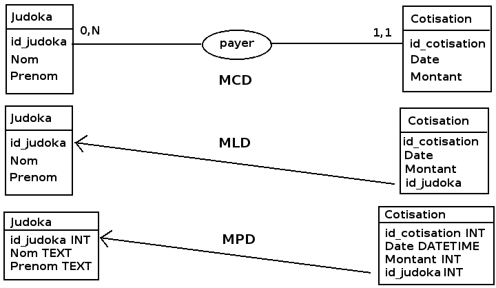
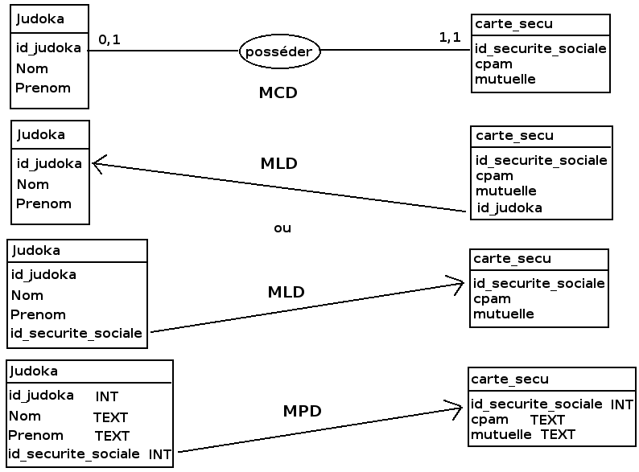
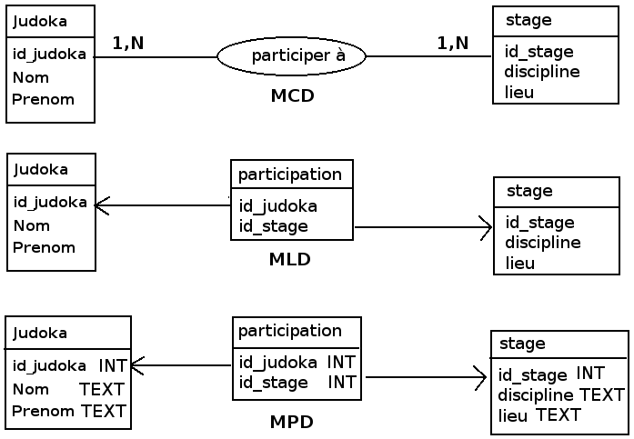

# Conception des bases de données
- Du cahier des charges au MCD
    - Analyser le cahier des charges
    - Décrire les entités et associations
- Du MCD au MLD
- Le Modèle Physique
    - Récapitulatif.
    - Les types de données
        - Les types numériques.
        - Les chaînes de caractères.
        - Les dates.
        - Quelques autres types.
        - La valeur NULL.
    - Jeu de caractères et interclassement
        - Le codage des caractères.
        - Les jeux de caractères.
        - L'interclassement.
    - Normalisation
        - Clé primaire.
        - Atomicité.
        - Stabilité dans le temps.
        - Dépendances fonctionnelles.

Dans cette partie, nous nous posons la question de comment concevoir une base de données relationnelle. Après avoir présenté les spécificités du modèle relationnel, nous introduirons la notation UML qui nous servira à représenter de manière schématique le monde réel à modéliser.

La conception d'un schéma n'est pas une tâche technique ardue. L'expérience permettra d'éviter certaines erreurs communes et de mettre en place rapidement les "bonnes" solutions, éprouvées sur d'autres configurations similaires.

Le processus de construction d'une base de données est un processus qui est classiquement découpé en plusieurs étapes, chacune correspondant à un niveau de préoccupation différent :

1. Le **schéma conceptuel** décrit le monde réel au travers de la problématique étudiée. Il n'est pas encore question à ce stade de SGBD ni même d'informatique, mais uniquement de décrire de manière "standardisée" le monde réel. 
2. Le **schéma logique** est une traduction du modèle conceptuel dans le modèle de la base de données. A cette étape, le choix du type de SGBD intervient (SGDB relationnel, réseau, orienté document, etc.).
3. Enfin le **schéma physique** correspond à l'enregistrement des données de la base de données dans le système d'exploitation de l'ordinateur. Cette étape peut faire intervenir le SGBD concrètement retenu pour l'implémentation (PostgreSQL, MariaDB ou Oracle pour une base de données relationelle par exemple).

La suite de cette partie se concentre sur l'élaboration de schémas logiques dans le cas des SGBD relationnels. Mais dans la pratique, nous mélangerons souvent les phases de conception des différents schémas pour établir le *modèle relationnel* de la base de donnée.

Remarque : la communauté historique des bases de données relationnelles privilégiait le modèle entité-association pour modéliser les bases de données. Aujourd'hui le language UML, très utilisé en programmation, l'est également pour le création de bases de données relationnelles. C'est ce formalisme que nous employerons pour décrire les schémas logiques. 

---
---
# Le modèle relationnel ou MRD
---
---
Il repose sur la théorie mathématique des ensembles. En raison de sa fiabilité et grace aux opérations qu'il rend possible sur les données, c'est le type de base de données la plus utilisé actuellement.

## Fondements et propriétés ##
Dans le modèle relationnel, les données sont contenues dans des *relations*.

> Une **relation**, ou **table**, est un ensemble de données relatives au même sujet.

Il s'agit d'une sorte de contrat sur la forme attendue des données. 
Une relation est classiquement représentée sous la forme d'une table possédant à ce titre une **en-tête** et des **lignes** (nous parlerons aussi parfois de **tuples**).

A un autre niveau, la **colonne** ou **attribut** est le constituant de base de la relation. Chaque colonne est caractérisée par un **nom** et un **domaine**. Le domaine d'une colonne permet de préciser des contraintes sur le contenu qui y est autorisé. Nous pouvons par exemple indiquer un type de données pour une colonne (texte, nombre entier, nombre à virgule, date, etc.) ainsi qu'une longueur et/ou précision pour les valeurs contenues (20 caractères, 32 bits, 5 décimales, etc.). Mais le domaine ne se limite pas à décrire le contenu de la colonne : il peut contenir des règles ou contraintes sur les valeurs qui y sont autorisées (valeur non nulle, inférieure à 10, date antérieure à la date du jour, etc.).

Exemple :

* La relation `VILLE` contient trois colonnes nommées :
	* `NOM`
	* `CODE_POSTAL`
	* `POPULATION`

Un représentation classique de cette relation sera : `VILLE(NOM, CODE_POSTAL, POPULATION)`

* Le domaine de la colonne `NOM` est le suivant :
	* Type : texte
	* Longueur : 100 caractères
	* Les caractères autorisés sont les suivants : 0-9, a-z, A-Z, caractères accentuées, espace, "- / ' &"
	* Valeur nulle non autorisée
	* Pas de valeur par défaut
* Le domaine de la colonne `CODE_POSTAL` est le suivant :
	* Type : texte
	* Longueur : 5 caractères
	* Les deux premiers chiffres doivent correspondre à un numéro de département
	* Valeur nulle non autorisée
	* Pas de valeur par défaut
* Le domaine de la colonne `POPULATION` est le suivant :
	* Type : nombre entier
	* Longueur : 32 bits (*valeur max = 4 294 967 295*)
	* Valeur nulle par défaut

Un exemple de relation `VILLE` résultante est donné ci-dessous :

| NOM              | CODE_POSTAL | POPULATION  |
|:-----------------|:-----------:|------------:|
| Paris            | 75000       | 2229621     |
| Champs-sur-Marne | 77420       | 24913       |
| Ajaccio          | 2A004       | 67507       |

## Notion de clé primaire et étrangère ##
Une autre notion fondamentale dans le modèle relationnel est celle de clé primaire et étrangère.

> Une **clé primaire** est une colonne, ou un groupe de colonnes, permettant d'identifier de manière unique une ligne dans une relation.

> Une **clé étrangère** est utilisée pour lier des relations entre elles. Il s'agit d'une colonne de la relation qui fait référence à une clé primaire d'une autre relation.

## Associations entre relations ##
Les types d'association possibles entre relations diffèrent par le nombre de lignes impliquées dans les différentes tables associées. Ce nombre d'objets impliqués est appelé **cardinalité**. Voici quelques exemples de cardinalité :

* **1-1** : un pays a une capitale, et une capitale est dans un seul pays
* **1-N** ou `1-*` : un pays possède plusieurs villes, mais une ville n'est que dans un seul pays
* **N-M** ou `*-*` : un pays possède des frontières et ces frontières concernent plusieurs pays

Dans le cas des liens **N-M**, il arrive qu'une information à stocker ne puisse être rattachée à aucune des deux tables impliquées. Prenons l'exemple d'une base de données où sont enregistrées les informations sur les personnes et les entreprises dans lesquelles elles travaillents. Notre base serait alors constituée de deux relations : `Personne` et `Entreprise`, avec chacune diverses colonnes permettant de caractériser ces objets. La cardinalité entre ces deux relations est de type **N-M** : une personne peut avoir plusieurs emplois et une entreprise emploie plusieurs personnes. Si l'on s'intéresse aux salaires touchés par une personne pour ses emplois, l'information ne peut pas être stockée dans la relation `Entreprise` : toutes les personnes d'une entreprise n'ont pas le même salaire. Mais elle ne peut pas non plus être stockées dans la relation `Personne` : une personne peut toucher des salaires différents pour chacun de ses emplois. L'information sur ce que gagne une personne pour un travail donné est intimmement liée à la relation entre `Personne` et `Entreprise`. Dans ce cas de figure, le modèle relationnel nous permet de créer une **table d'association**.

> Une **table d'association** est une relations apportant des informations sur une association.

Pour l'exemple précédent, nous ajouterions à notre modèle une relation `Travail` composée de 3 colonnes : `id_personne`, `id_entreprise` et `salaire`. `id_personne` et `id_entreprise` étant des clés étrangères faisant référence respectivement aux clés primaires de `Personne` et `Entreprise`. `salaire` est quand à elle une colonne de type nombre à virgule, dont la valeur ne peut être que positive.

## Parenthèse sur les types de données ##
Pour chaque colonne, nous précisons le type de la données stockées. Nous listons ici les types de données couramment rencontrés dans les SGBD [L'intitulé exact du type dépendra du SGBDR. C'est une information qui apparaîtra donc dans le schéma physique]

* Types numériques
	* Integer : entier relatif stocké sur 32 bits (valeur max = $2^{31}-1$)
	* Bigint : entier relatif stocké sur 64 bits (valeur max = $2^{63}-1$)
	* Float : nombre à virgule stocké sur 32 bits (valeurs permises -1.79E+308 à -2.23E-308, 0 et 2.23E-308 à 1.79E+308)
	* Real : nombre entier double précision stocké sur 64 bits (valeurs permises -3.40E+38 à -1.18E-38, 0 et 1.18E-38 à 3.40E+38)
* Caractères : 
	* Char : un unique caractère 
	* Character : suite de caractères de longueur fixe comprise entre 1 et 8000
	* Varchar : suite de caractères pour laquelle l'espace de stockage de chaque valeur peut être différent 
	* Text : texte de longueur indéterminée
* Booléen :
	* Boolean
* Dates et heures
	* Date : date seule
	* Time : heure seule
	* Datetime : date et heure
	* les types dates et heures peuvent être avec ou sans fuseau horaire (timestamp)
 
## Opérations de l'algèbre relationnelle ##
L'intérêt principal du modèle relationnel est qu'il rend possible les opérations sur les relations et entre les relations. Ces opérations, au nombre de huit, produisent de nouvelles relations à partir de la ou des relations sur lesquelles elles s'appliquent.

Les opérations s'appliquent soit sur une seule relation :

* la sélection;
* le renommage;
* la projection.

Soit sur deux relations :

* l'union;
* l'intersection;
* la différence;
* le produit cartésien;
* la jointure.

Dans la suite, nous voyons dans le détail le résultat produit par ces opérations.

## La sélection ###
La sélection ne conserve que les lignes répondant à une condition.

## Le renommage ##
Le renommage modifie le nom d'une colonne dans une relation.

## La projection ##
La projection crée une nouvelle relation contenant l'ensemble des lignes d'une relation initiale, mais en ne conservant que certaines colonnes.

## L'union ##
L'union réunit dans une même relation les éléments communs de deux relations initiales.

## L'intersection ##
L'intersection réunit dans une relation les éléments qui sont dans les deux relations initiales.

## La différence ##
La différence réunit dans une relation les éléments d'une relation donnée qui ne se trouvent pas dans une autre.

## Le produit cartésien ##
Le produit cartésient combine dans une relation les éléments de relations en entrée.

## La jointure ##
La jointure combine dans une relation des éléments de deux relations répondant à un critère de jointure

---
---
# Modélisation à l'aide d'UML
---
---

A ce stade du cours, nous sommes capable de décrire de manière textuelle une relation en précisant, là encore de manière textuelle, les domaînes des différentes colonnes. Cette manière de procéder par descriptions textuelles ne sera satisfaisante que pour une ou deux petites tables, mais deviendra très vite laborieuse à mettre en oeuvre dès que la taille de la base augmentera (nombre de tables, nombre de colonnes).

L'apprentissage d'un formalisme standardisé va nous permettre de résoudre ce problème.

## Généralités ##
**Unified Modeling Language** (UML) est un langage graphique utilisé pour la conception de programmes informatiques. Conçu initialement pour les besoins de la programmation orientée objets, ce langage graphique c'est aujourd'hui largement diffusé et est utilisé dans de nombreux domaînes informatiques. 

Deux caractéristiques ont contribué à sa démocratisation : les diagrammes UML sont facilement lisibles par un humain et sont interprétables par les ordinateurs. Il est ainsi possible de créer des programmes ou bases de données directement à partir de schémas réalisés en UML.

L'utilisation d'UML aboutit à la réalisation de diagrammes. Dans le cadre de ce cours, nous nous intéresserons au **diagramme de bases de données** (aussi appelé **diagramme de classes**).

    Actuellement en version 2
    14 diagrammes :

---
---
# Modèle E-A ou MCD
---
---
Le Modèle Entité-Association créé en 1976 ou le Modèle Conceptuel des Données (MCD) fait partie de la méthode de conception et réalisation de projets informatiques à l'aide de MERISE créé en 1978-1979.

Le but de cette méthode est d’arriver à concevoir un système d’information, avant son développement, afin de prévoir en amont les différents problèmes que l’on va rencontrer et donc de les éviter.

MCD permet d’écrire de façon formelle les données qui seront utilisées par le système d’information. Il s’agit d’une représentation des données, facilement compréhensible, permettant de décrire le système d’information à l’aide d’entités.

Une entité est la représentation d’un élément matériel ou immatériel ayant un rôle dans le système d’information.

## Merise
Merise est une méthode d'analyse, de conception et de gestion de projet intégrée, ce qui en constitue le principal atout.

Issue de l'analyse systémique, la méthode Merise est le résultat des travaux menés par Hubert Tardieu dans les années 1970 et qui s'inséraient dans le cadre d'une réflexion internationale, autour notamment du modèle relationnel d'Edgar Frank Codd. Elle est devenue un projet opérationnel au début des années 1980 à la demande du ministère de l'industrie, et a surtout été utilisée en France, par les SSII de ses membres fondateurs (Sema-Metra, ainsi que par la CGI Informatique) et principalement pour les projets d'envergure, notamment des grandes administrations publiques ou privées.

## Introduction ##
Etape 1:
- Formuler les règles métiers
- Etablir le dictionnaire de données
- Identifier les dépendances fonctionnelles

Etape 2:
- Lister les entités (id + attributs)
- Déterminer les associations (cardinalités + attributs)

## Entité ##
Une entité est la représentation d’un élément matériel ou immatériel ayant un rôle dans le système que l’on souhaite décrire. Une entité est composée de propriétés, des données permettant de la décrire.

Par exemple, prenons une Ford Fiesta, une Renault Clio et une Opel Astra, elles feraient toutes parties d’une entité que l’on peut nommer «Voiture». 

Chaque **Entité** est représentée sous la forme d'un rectangle constitué de deux cases. Le nom de la entité est écrit dans la case du haut, tandis que la liste des colonnes l'est dans la case du bas.

Définitions
- une **Entité** est un ensemble d’objets du même type défini par un ensemble de propriétés
- une **Propriété** est une donnée ayant un sens et pouvant être utilisée de manière autonome

La syntaxe pour une colonne est `nom_colonne: type(longueur) {contraintes eventuelles}`. 

Les noms de la colonne ou des colonnes utilisés comme clé primaire sont soulignés. Ceux de colonnes correspondant à des clés étrangères sont précédés d'un `#`[Attention, certains utilisateurs d'UML ne respectent pas cette règle et l'on pourra ainsi rencontrer des représentations légèrement différentes des clés primaires et étrangères].

Définitions
- une **Occurrence** est une réalisation particulière d’une entité
- un **Identifiant (ou clé primaire)** est une propriété dont la valeur discrimine une occurrence par rapport à toutes les autres

## Associations  ##
Lorsque les tables sont liées entre elles, il convient de tracer un trait entre elles. 

- Une **Association** est un lien sémantique reliant deux entités et pouvant avoir des propriétés
- Les **Cardinalités** sont les nombres minimum et maximum d’occurrences d’une entité par rapport à une association et sont indiquées de chaque coté du trait.

Cardinalité 1-1 : un pays n'a qu'une seule capitale

Cardinalité 1-N : un pays a plusieurs villes

Cardinalité M-N : un pays a plusieurs frontières qui concernent plusieurs pays

La représentation pour les tables d'association est identique à celle des table classiques. Elles sont liées aux liens par des traits en pointillets.

## Exemple - Modélisation (très) simpliste d’un département de l’IUT ##

## Agrégation, composition ##
UML permet d'indiquer qu'une entité est une partie d'un autre entité. Nous parlons alors de relations de **composition** ou d'**agrégation**. Par exemple : une rivière est composée de tronçons de cours d'eau. 

Ce type de relation n'a pas de sens particulier dans le modèle relationnel (elles sont traduites comme des relations simples). Il permet uniquement d'ajouter des informations dans le modèle UML et d'en faciliter la lecture et compréhension.

UML permet de nuancer la nature de la composition. La **relation d'agrégation** est représentée par un trait se terminant par un losange blanc du côté de l'agrégat. Il s'agit d'une **agrégation simple** d'entités.

La **relation de composition** est quand à elle représentée part un trait se terminant par un losange blanc du côté de l'agrégat. Elle caractérise une **agrégation forte**, au sens où elle ajoute des contraintes sur le cycle de vie des entités : unicité de l'appartenance, disparition des objets composants avec la disparition de l'objet composé.

Par exemple, une école est composée de cycles et est aussi composée d'étudiants. Pour autant, la relation école-cycle n'est pas de même nature que école-étudiant : si on supprime l'école, on supprime également les cycles : c'est une relation de composition. Mais les étudiants ne disparaissent pas si l'on supprime l'école : c'est une relation d'agrégation.

Autre exemple, une maison est une agrégation de murs. Il n'y a pas unicité d'appartenance (un même mur peut être partagé par plusieurs maison). Et si l'on détruit la maison, les murs ne sont pas pour autant tous supprimés. De même un mur peut exister sans appartenir forcément à une maison. En revanche la maison est composée de fenêtres : il y a unicité d'appartenance (une fenêtre ne peut pas être dans deux maisons à la fois) et la destruction de la maison entraîne la destruction de toutes ses fenêtres.

---
---
# MLD
---
---
Le MCD (Modèle Conceptuel de Données) ne peut pas être implanté dans une base de données sans modification car il est indépendant de l'organisation informatique de l'entreprise. Il ne prend pas en compte, par exemple, les systèmes d'exploitation utilisés (MS-Dos, Windows, Linux, ...), les langages de programmation ou même les logiciels disponibles sur ces systèmes. 

Il est obligatoire de transformer ce modèle. On dit qu’on effectue un passage du modèle conceptuel de données vers le modèle logique de données.

Le MLD constitue une étape intermédiaire entre le MCD et le MPD (modèle physique) directement implémenté sur la machine cible.

Il s'agit donc pour le MLD de déterminer la structure générale des informations à stocker dans le système informatique.

## Règles de passage du MCD au MLD :
Dans le MLD, les cardinalités disparaissent et sont remplacées par une ou plusieurs flèches dont le
sens dépend des cardinalités.

Le sens d’une flèche représente le mouvement que fera ensuite, dans le modèle physique de
données, la clé primaire d’une table : soit la flèche s’arrête à la relation, soit
elle se prolonge directement jusqu’à la table opposée.

De manière simplifiée et raccourcie, les règles sont les suivantes :

- Toute entité se transforme en fichier (ou table logique).

- Lorsque la relation contient une cardinalité simple, la flèche part de l’objet ayant la cardinalité
multiple vers celui ayant la cardinalité simple. La flèche ne s’arrête pas à la relation.

- Lorsque la relation contient 2 cardinalités multiples, une flèche part de chaque objet vers la
relation et s’y arrête :

---
---
# Comment passer d’un MCD à un MRD ?
---
---
## Entité = Relation

## Association binaire 1,1 - 0/1,1/N

## Association binaire 0/1,N - 0/1,N

## Association avec propriétés

## Association ternaire

## Transformation du MCD d’un département en MRD

---
---
## MPD
---
---

La modélisation physique des données (MPD) est la dernière des trois étapes de la modélisation des données. Les concepteurs de bases de données produisent des modèles physiques de données à partir des modèles créés lors des étapes de modélisation conceptuelle et logique des données. Les modèles créés à ce stade permettent une dénormalisation gérée et tiennent compte de la technologie cible pour le déploiement. Ils sont suffisamment complets pour représenter la conception de la base de données telle qu’elle a été mise en œuvre, ou telle qu’elle doit être mise en œuvre.

Deux types de changements entre MLD et MPD :
- Entités => Tables
- Propriétés => Champs

Le passage du MLD au MPD se fait simplement en précisant les types des champs

---
---
## Conclusion
---
---

Dans le cas de figure "1 vers N" on a la cardinalité 0,N (ou 1,N) d’un coté et 0,1 (ou 1,1) de l’autre coté. L’exemple suivant indique qu’une cotisation donnée a été payée par un et un seul judoka tandis qu’un judoka peut payer 0 à N cotisations (selon le nombre d’années d’inscription au club).

Le passage du MCD au MLD se fait de la façon suivante :

    Les deux entités deviennent des tables ;
    Les identifiants, dans ces des tables, deviennent des clés primaires ;
    L’association devient une clé étrangère (id_judoka) ajoutée dans la table cotisation.

Le passage du MLD au MPD se fait simplement en précisant les types des champs

Dans le cas de figure "1 vers 1" on a la cardinalité 0,1 (ou 1,1) d’un coté et 0,1 (ou 1,1) de l’autre coté. L’exemple suivant indique qu’un judoka possède 0 ou 1 carte de sécurité sociale et qu’une carte de sécurité sociale donnée appartient à un et un seul judoka. 
 
Le passage du MCD au MLD se fait de la façon suivante :

    Les deux entités deviennent des tables ;
    Les identifiants deviennent des clés primaires ;
    L’association devient une clé étrangère (id_judoka) ajoutée dans la table carte_secu ou une clé étrangère (id_securite_sociale) ajoutée dans la table judoka.

Le passage du MLD au MPD se fait en précisant les types des champs. 

Dans le cas de figure "N ver N", on a la cardinalité 0,N (ou 1,N) d’un coté et 0,N (ou 1,N) de l’autre coté L’exemple suivant indique qu’un judoka donné participe à nombre de stages pouvant varier de 1 à N et qu’un stage donné a une participation d’un nombre de judokas pouvant varier de 1 à N 

Le passage du MCD au MLD se fait de la façon suivante :

    Les deux entités deviennent des tables ;
    Les identifiants id_judoka et id_stage des tables judoka et stage deviennent des clés primaires ;
    L’association devient une table (participation) dotée de deux clés étrangères (id_judoka et id_stage).

Le passage du MLD au MPD se fait simplement en précisant les types des champs. 

## Etape par etape
- Du cahier des charges au MCD
    - Analyser le cahier des charges
    - Décrire les entités et associations
- Du MCD au MLD
- Le Modèle Physique
    - Récapitulatif.
    
## Exemple
- Les entités, les attributs et le MCD
    - Un cahier des charges très simple.
    - L'entité produit.
    - Les attributs d'un produit.
    - La syntaxe MoCoDo des entités.
    - Obtenir le diagramme MCD.
- Les associations et les cardinalités
    - Perfectionnons le cahier des charges.
    - L'entité categorie.
    - L'association appartenir.
    - La syntaxe MoCoDo des associations et des cardinalités.
    - Obtenir le diagramme du MCD.
- Les associations et les cardinalités
    - Perfectionnons le cahier des charges.
    - L'entité client.
    - L'association commander.
    - Obtenir le diagramme du MCD.
- Les associations et les cardinalités
    - L'entité commande.
    - L'association contenir.
    - Le diagramme final.
    - Les différentes cardinalités possibles.
- Du MCD au MLD
- Le Modèle Physique
    - Récapitulatif.
    - Les types de données
    - Jeu de caractères et interclassement
    - Normalisation

---
---
# Utiliser MoCoDO
---
---

Mocodo est un logiciel d’aide à la modélisation de base de données, notamment à des fins d’apprentissage du SQL. L’enseignement et la modélisation est ainsi simplifiée. L’outils est simple, il suffit d’écrire textuellement les entités et associations du modèle conceptuel de données (MCD). Il peut alors générer le diagramme entité-association en SVG et son schéma relationnel (MLD) en SQL.

http://mocodo.wingi.net/

L’outils est open-source, ce qui signifie qu’il est libre et gratuit. Vous pouvez l’installer sur votre propre ordinateur.

L’un des grands avantages de l’outil est la beauté des diagrammes généré et la simplicité à les éditer ou imprimer.

A noter, le nom est inspiré de “Modélisation Conceptuelle de Données”, tandis que le slogan de l’outil est “Nickel. Ni Souris”.

## Exemple concret

Code en entré :

DF, 11 Élève, 1N Classe
Classe: Num. classe, Num. salle
Faire Cours, 1N Classe, 1N Prof: Vol. horaire
Catégorie: Code catégorie, Nom catégorie

Élève: Num. élève, Nom élève
Noter, 1N Élève, 0N Prof, 0N Matière, 1N Date: Note
Prof: Num. prof, Nom prof
Relever, 0N Catégorie, 11 Prof

Date: Date
Matière: Libellé matière
Enseigner, 11 Prof, 1N Matière

Génération du MCD (diagramme conceptuel) par Mocodo :

Génération du MLD (schéma relationnel) par Mocodo :

