# Découverte du langage HTML et CSS
HTML est un héros et CSS est son acolyte, un peu comme Batman et Robin. Tout comme l'homme chauve-souris, HTML n'a pas besoin de CSS pour fonctionner. Par exemple :
http://motherfuckingwebsite.com/
Malgré l'absence de code CSS, le site reste consultable.
Par contre, pour un fichier CSS, sa vie n'a aucun sens s'il n'est pas en couple avec un fichier HTML.
## Découverte d'HTML
### Son rôle
HTML (HyperText Markup Language) est un langage de balisage qui permet de structurer les informations d'un document web. Il est généralement destiné à être lu par un navigateur pour formater correctement le texte.
Il est aussi parcouru par des robots pour indexer une page sur les moteurs de recherche ou par des assistants pour les personnes atteintes d'un handicap qui les empêches d'utiliser un écran.
Bien choisir les balises quand on structure un document permet d'améliorer sa compréhension par les bots de Google, les assistants vocaux et même par vous lorsque vous relirez votre code.
### La structure d'un document HTML
```html
<!DOCTYPE html>
<html lang="fr">
<head>
  <!-- Information sur la page -->
</head>

<body>
  <!-- Contenu de la page-->

</body>
</html>
```
- `doctype` définit le type du document.
- `<html>` marque le début et la fin du document. Remarquez également l'attribut `lang="fr"` qui permet à un assistant vocal de lire correctement les textes (par exemple : les accents)
- `<head>` inclut les informations sur la page comme son titre, sa description. C'est là où l'on place d'autres métadonnées comme les liens vers les ressources CSS et Javascript, la favicon, le comportement en responsive, …
- `body` corresponds à la partie visible du document, là où le contenu de la page sera visible pour les utilisateurs.
### Liste et définitions des éléments HTML
[https://web.iamvdo.me/html/balises/](https://web.iamvdo.me/html/balises/)
### Vocabulaire à connaitre
- Un `id` est un identifiant. Il doit être unique dans la page parce qu'il sert de repère pour aller directement à une section du document. Il se créée avec la syntaxe`<p id="nom-id">` et on le lie avec un lien `<a href="#mon-id">`.
- Une `class` est une spécificité pour le CSS. Elle permet de créer une ou plusieurs « étiquette(s) », ce qui permet d'appliquer la même mise en forme à tous les éléments qui partage le même nom de classe. On déclare une classe comme ceci : `<p class="class autre-class class-trois">`. Le nom d'une classe ne peut pas commencer par un chiffre.
- Les attributs (`attr`) permettent de donner une information complémentaire (l'adresse d'un lien avec `href`) ou le comportement par défaut d'un élément comme `autoplay` pour une vidéo
###

### Son rôle
CSS (Cascade Style Sheet) est un langage de présentation qui permet aux navigateurs de comprendre comment mettre en page un document HTML. Un fichier CSS s'appelle dans le HTML de cette manière
````html
<link rel="stylesheet" media="screen" href="chemin/nom-du-fichier.css" >
````
La convention actuelle est de nommer son fichier css `style.css`. L'attribut `media` existe parce que CSS n'est pas uniquement destiné aux écrans. On peut aussi styler un document pour son rendu en impression par exemple.
### Déclaration d'une règle CSS
````CSS
sélecteur {propriété: valeur;}
````
- Un sélecteur sert à déclarer aux navigateurs pour quels éléments il doit appliquer ce style.
- Une propriété est le nom de la propriété que l'on souhaite changer (taille de police par exemple).
- La valeur est la nouvelle valeur que le navigateur doit appliquer (18px)
 #### Exemple :
````CSS
p {color: blue}
````
Avec cette règle, tous les paragraphes `<p>` du site seront colorés en bleu. Pour les `id`, les `class`, et les `attributs`, le sélecteur porte cette syntaxe :
````CSS
#id {}
.classe {}
[attr="nom-attribut"]
````
### La relation parent / enfant
Comment faire pour styler tous les liens `<a>` uniquement lorsqu'ils sont dans un paragraphe `<p>` ? Pour résoudre ce problème, le concept de parentalité entre dans le game. Par exemple :
````HTML
<p>je suis un paragraphe qui contient <a href="https://google.com">un lien vers google</a>
````
Le lien se trouve à l'intérieur du paragraphe donc `<p>` devient le parent du `<a>` qu'il héberge.
Donc pour styler les liens dans les `<p>`, le CSS s'écrit de cette façon :
`````CSS
p a {font-weight: bold}
``````
À partir de maintenant, tous les liens qui se trouve dans une balise `<p>` seront en gras.
### Une même règle pour plusieurs sélecteurs ?
Pour styler plusieurs éléments de la même manière, on sépare les sélecteurs par une virgule.
``````CSS
h1,h2,h3,
h4,h5,h6 {font-family : "Nom de la police"}
``````
### CSS et le poids des ~~mots~~ sélecteurs
Pour départager deux styles différents pour un même sélecteur, le navigateur va vérifier deux choses :
- Quel sélecteur a le plus de poids
- Et si le poids est égal, il va sélectionner le style qu'il a trouvé en dernier.

Pour peser des sélecteurs, le navigateur leur applique les scores suivants : +100 points pour les `#id`, +10 points pour les `.class`, attributs `[attr]` et pseudo-classes et 1 point pour les éléments (ex: `p`) et pseudos-éléments. Ce poids porte le nom de **spécificité**
Pour mieux comprendre la spécificité CSS ➡ [calculette de spécificité](https://specificity.keegan.st/)

### Pseudo-classes
Une pseudo-classe est une expression qu'on attache à un sélecteur pour le styler dans un contexte plus spécifique. Par exemple, je peux avoir besoin de changer la couleur d'un lien quand je le survole ; où bien agrandir la taille du premier paragraphe se trouvant dans une balise `<article>` sans toucher aux autres. Voici quelques exemples :
````CSS
/* change la couleur quand je survole un lien */
a:hover {color:#fb1}

/*
   Change la couleur de bordure d'un textarea quand il est sélectionné
   par le clavier (TAB) ou par la souris
*/
textarea:focus {border-color: red}

/*
  Change la taille d'un <p> uniquement s'il est le premier enfant de son parent.
  Donc ici :
  <article>
    <h1>titre</h1>
    <p>texte</p>
  </article>
  ne fonctionnera pas parce que <p> est le deuxième enfant de <article>
*/
p:first-child {font-size: 20px}

/*
  Change la taille d'un <p> uniquement s'il est le dernier enfant de son parent.
  Donc la même règle s'applique que pour first-child
*/
p:last-child
````
👉 [La liste de toutes les pseudo-classes](https://developer.mozilla.org/fr/docs/Web/CSS/Pseudo-classes). Les plus utiles sont celles qui contiennent un « child » ou « not » pour cibler plus précisément. « hover », « focus » et « active » sont utiles pour styler les réactions — appelé « micro-interaction » —quand l'utilisateur agit sur un élément.

### Pseudo-éléments
Les pseudo-éléments servent à styler une fraction d'un élément comme sa première lettre par exemple. Ils servent aussi à créer des éléments virtuels qui n'apparaissent pas dans le HTML afin de bien séparer le contenu de sa forme.
#### Exemple de pseudo-élément
`````CSS
/*Pseudo élément pour styler une fraction d'un élément*/
p:first-letter {font-size: 22px};
p:first-line {color: ~#bada55;}

/* Pseudo élément pour créer des éléments virtuels*/
/* Injecte "coucou" avant le texte <p>*/
p:before {content:"coucou"}
/* Injecte "coucou" après le texte <p> */
p:before {content:"beuh !!"}
`````
👉 [La liste de tous les pseudo-éléments](https://developer.mozilla.org/fr/docs/Web/CSS/Pseudo-%C3%A9l%C3%A9ments). Les plus utiles sont `before` et `after`. `placeholder` est aussi utile pour mieux styler les formulaires.

### Appeler un fichier avec CSS
Pour dire au navigateur d'aller chercher une image d'arrière-plan par exemple, on déclare utilise `url("chemin/fichier.jpg")` :
`````CSS
sélecteur {background-image: url("chemin/fichier.jpg")}
``````
## HTML et CSS, chacun son business
Il est important de comprendre qu'HTML sert pour livrer du contenu et CSS pour dire comment le présenter. On ne se préoccupe jamais du rendu d'un texte dans le HTML. Un texte tout en capitales doit être fait avec CSS par exemple. Un texte en gras doit être une information importante. Si c'est pour le style, alors c'est CSS qui doit gérer ça.

# [TD2/6] CSS kickstart
## CSS Box Model
``````CSS
*,
*:before,
*:after {
  box-sizing: border-box;
}

.box {
  background: #fb1;
  border-right: 10px solid black;
  padding-right: 10px;
  width: 500px;
}
``````
À votre avis, quelle est la largeur réelle de l'élément ? Les paddings et les bordures se soustraient ou s'ajoutent au `width` de 500 pixels ?
C'est précisément à cette question que le box model doit répondre. Il se déclare avec la propriété `box-sizing` et permet de dire au navigateur comment il doit calculer la taille d'un élément.
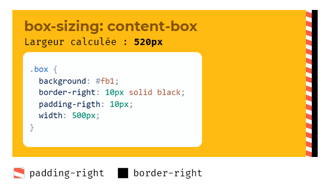
Comme on le voit sur l'illustration, `border-box` offre plus de confort parce que cela nous évite de devoir faire des calculs pour éviter de tout casser. La valeur par défaut des navigateurs est `content-box` donc on devra appliquer le code suivant :
``````CSS
*,
*:before,
*:after {
  box-sizing: border-box;
}
``````
### Pourquoi `border-box` n'est pas la valeur par défaut ?
Parce que la philosophie des navigateurs est d'être rétro-compatible. Changer la valeur par défaut signifierait casser des millions de sites qui ont été intégré quand `box-sizing` n'existait pas.

## Les sélecteurs CSS
Dans la première semaine, on a vu que pour styler un élément HTML, une règle CSS prend cette syntaxe :
```````CSS
sélecteur {propriété: valeur}
````````
Pour sélectionner tous les éléments, on utilise le symbole `*` :
``````CSS
* {margin: 0}
``````
On peut imbriquer les sélecteurs pour être plus précis et styler un élément dans un contexte bien défini :
``````CSS
li a {color: green}
``````
Dans le code ci-dessus, on demande de styler les liens uniquement lorsqu'ils sont dans des éléments de liste.
### Passez en mode sniper
Au delà de la sélection pure, il existe des outils qui nous permettent d'affiner davantage notre ciblage. Par exemple :
``````HTML
<li>
  <p>
    <a href="">mon lien</a>
  </p>
<li>
``````
Ici, selon le CSS déclaré au-dessus, mes liens seront en vert parce que le navigateur aura trouvé un `<a>` dans un `<li>`. Comment faire pour empêcher ce comportement ? Avec un sélecteur d'enfant direct.
### Sélecteur d'enfant direct
``````CSS
li > a {color: green}
``````
Le chevron qui s'est incrusté entre `li` et `a` permet de dire :
> « Cher navigateur, style les liens dans les `li` en vert uniquement quand il y a rien entre les deux. Bisous. »

Ici,
``````HTML
<li>
  <p>
    <a href="">mon lien</a>
  </p>
<li>
``````
Les liens ne seront pas colorés en vert parce qu'il y a un `<p>` entre les deux. Par contre,
``````HTML
<li>
  <a href="">mon lien</a>
<li>
``````
Là, le style sera appliqué parce qu'il n'y a rien entre les deux éléments.
#### Les autres sélecteurs avancés
Plutôt que de vous détailler chaque sélecteur comme au-dessus et d'avoir des décès d'ennuis sur la conscience, je vous propose de jouer à [CSS Diner](https://flukeout.github.io/) qui vous donnera les clés pour être à l'aise avec la plupart des sélecteurs.

## Les unités CSS
Pour pouvoir dimensionner, CSS offre toute une panoplie d'unité de mesure qui peuvent répondre à un besoin précis selon les cas.
### Causons accessibilité avant
Excepté dans quelques cas exotique, il y a un consensus pour que la valeur par défaut de `font-size` soit de 16 pixels.
Par contre, si je suis déficient visuel ou que mon écran se trouve loin (comme une TV), je peux aller dans mes paramètres de mon navigateur et agrandir la taille de police par défaut. Et si je m'embête à faire ces réglages, j'aimerai bien qu'ils soient appliqués partout. Donc c'est à l'intégrateur de faire le job pour que ce soit le cas.
### pixel
``````CSS
p { font-size: 16px}
``````
 - 👍 Simple à déclarer
 - 👎 Unité fixe. Le navigateur n'agrandit pas le texte donc vous ne respectez pas les préférences des utilisateurs (HONTE À VOUS)
### em
Le `em` est une unité relative à la taille déclarée sur le parent. Sa valeur en pixel est calculée par multiplication :
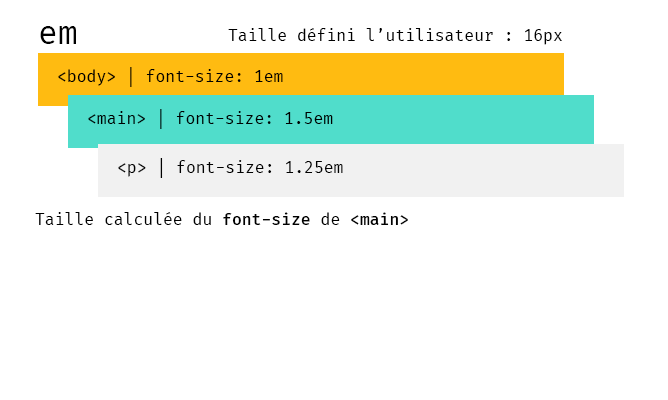
 - 👍 Unité relative donc elle respecte les préférences utilisateurs
 - 👎 Peut vite devenir complexe comme sur le `<p>` de l'exemple où 3 multiplications sont nécessaires pour obtenir va valeur en pixels. Beaucoup trop de calvities sont apparues à cause de ça.
 ### rem, le meilleur des mondes
 Le rem est apparu pour gommer le défaut de `em` en se référant uniquement à la racine du document : le `font-size` de l'élément `html` s'il a été changé, ou le `font-size` défini par le navigateur.
 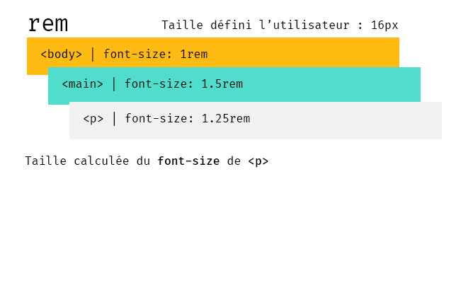
  - 👍 Unité relative
  - 👍 Une seule opération à faire pour prédire sa conversion en pixel.
### vw, vh
Les deux dernières unités à connaitre pour couvrir la plupart des cas de figure sont les unités relatives au viewport. Le viewport est la taille disponible sur votre écran pour afficher le contenu de la page. `vw` est pour « viewport width », et `vh` pour « viewport heigth ».

## Le positionnement
Pour déplacer un élément de son emplacement d'origine, on va modifier sa position via la propriété … `position`
### Position relative
La position relative déplace un élément depuis son emplacement d'origine.
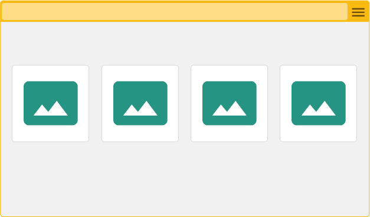
Remarquez que la place que l'image occupait avant son déplacement est toujours reservée.
### Position absolute : qui va à la chasse perd sa place
Un élément avec une `position: absolue` se positionne par rapport au premier parent en position relative ou sinon, par rapport à la fenêtre.
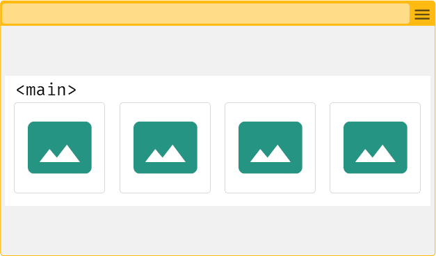
Dès qu'on déclare une position absolue, l'élément perd son emplacement et ses frères viennent occuper l'espace laissé libre. On dit qu'il sort du flux.
### Position fixed
Une position avec une valeur `fixed` permet de coller un élément à un endroit de la fenêtre. Elle aura toujours pour origine la fenêtre.
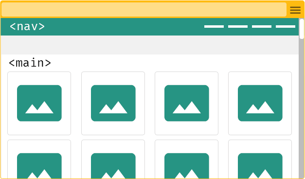
De la même manière que pour la position absolute, le navigateur lui retire la place qui lui était réservé dans le flux.
### Z-index
Quand plusieurs éléments se chevauche, comment dire au navigateur quel élément doit passer au-dessus ? C'est là que la propriété `z-index` intervient.
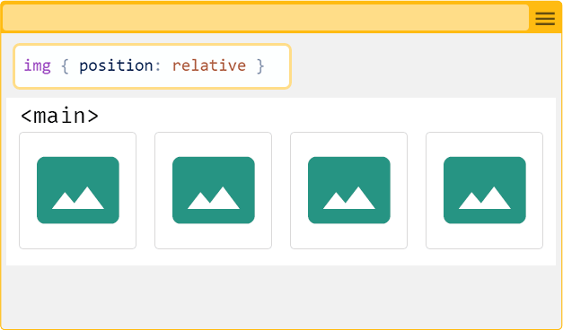
Si la valeur de `z-index` est supérieure et a une position autre que `static`, l'élément passera au-dessus.
__Attention__
``````CSS
.box {position: relative}
.box:nth-child(1) {z-index: 1;}
.box:nth-child(2) {z-index: 2;}

.box:nth-child(1) .child {
  position: relative;
  z-index: 3;
}
``````
Dans le code ci-dessus, on pourrait penser que `.child` va passer au-dessus de `box:nth-child(2)` parce qu'il a un `z-index` supérieur… Eh bien non. Si son parent a un z-index inférieur, il restera en dessous parce que le z-index est comparé d'abord avec la valeur de ses frères. C'est ce qu'on appelle le contexte d'empilement.

## Le responsive design
Le responsive design est la solution pour pouvoir adapter une interface web à n'importe quelle taille d'écran. Cette solution est dépendante du viewport.
### Le viewport
Le viewport est la place disponible pour afficher le contenu. Avant l'invention de la balise `<meta name="viewport">`, un site web se comportaient comme une image : il se réduisait jusqu'à ce qu'il rentre entièrement dans la zone d'affichage
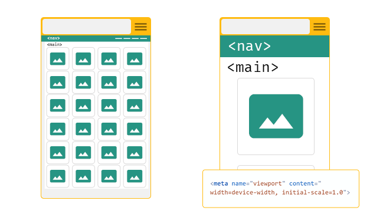
Avec un viewport `width=device-width, initial-scale=1.0`, l'écran est forcé d'utilisé sa taille réelle et la consultation devient possible sans zoomer / dézoomer son écran.
### Les media queries
Pour changer la mise en page d'un site à partir d'une taille définie :
``````CSS
@media screen and (min-width: 600px) {
  body {
    font-size: 1.125rem;
  }
}
``````
Dès qu'une fenêtre aura 600 pixels disponible en largeur, la taille de police de `body` passera à `1.125rem` (18 pixels dans un contexte standard). La valeur de `min-width` est appelé _breakpoint_.
#### Mobile-first vs Desktop-first
Il y a deux approches quand on intègre un site responsive : Avec le mobile-first, on commence par déclarer sa mise en page pour les mobile, puis on modifie la mise en page au fur-et-à-mesure que la place disponible augmente.
Le desktop-first, c'est l'inverse. On part du plus grand pour arriver au plus petit.
##### Pourquoi le _mobile-first_ est une meilleure approche ?
Les conteneurs HTML de type _bloc_ ont une largeur par défaut de 100% et c'est ce qu'on veut sur mobile, faute de place. Les éléments autours du contenu sur un grand écran ne peuvent pas l'être sur mobile. Tout cela fait qu'en _desktop-first_, on doit produire du code inutile pour réadapter la mise en page
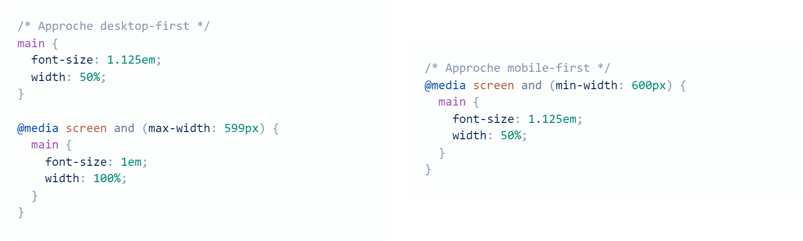
Comme `main` a une taille par défaut de 100% et un `font-size` de 1em, il est inutile de le déclarer pour les mobiles. Le code est plus léger. Maintenant, il est possible que dans certains cas, une approche desktop fist soit plus approprié. __Le plus important est de savoir ce qu'on fait et pourquoi on le fait.__
__Il est important de noter que le responsive n'est pas unidirectionnel.__  Un design peut être adapté en fonction de la hauteur de fenêtre disponible.
Notez aussi qu'on peut déclarer plusieurs conditions :
``````CSS
@media screen and (min-width: 600px) and (max-width: 800px) {
  body {
    background: yellow;
  }
}
``````
Ici, `body` changera sa couleur d'arrière-plan en jaune quand la largeur fenêtre sera comprise entre 600 et 800 pixels.
## Vérifier la compatibilité des nouvelles fonctionnalités
Les langages web évoluent avec le temps. Pour utiliser une nouvelle fonctionnalité, on doit s'assurer qu'elle soit compatible avec les navigateurs que l'on vise. La référence dans ce domaine est [Can I Use ?](caniuse.com/).


# CSS Layout
Dans ce module, on va commencer à créer des mises en pages qui permettent de mettre des éléments les uns a cotés des autres.


## Élément block vs élément inline
### Block
Les éléments de type _block_ sont les balises qui servent généralement à grouper plusieurs balise à l’intérieur tel que les `div`, `header`, `footer`, `main`, `li`, `section`, …
Leur particularité principale au niveau du CSS est de prendre toute la largeur par défaut, même si le contenu est composé d'un seul mot.
Ils peuvent contenir n’importe quelle balise valide _block_ ou _inline_
### Inline
La largeur des éléments _inline_ est égale à la taille de son contenu. On peut les styler en css mais les propriétés `width`, `height`, `padding-top`, `padding-bottom`, `margin-top`, `margin-bottom` sont ignorés.
Deux éléments `inline` qui se suivent dans le HTML seront côte à côte dans le rendu visuelle de la page
 [Liste des éléments block et inline](https://www.w3schools.com/html/html_blocks.asp)

### Comment convertir un élément inline en block, vise et versa ?
Pour pouvoir profiter de toutes les propriétés CSS d’un élément block sur un élément inline, il va falloir changer son `display`. La propriété CSS `display` permet de dire au navigateur comment l’élément doit se comporter.
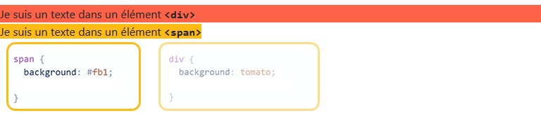
#### Pourquoi je n’ai pas mis `display: inline` sur la div orange ?
La valeur `inline-block` permet de faire un mix des deux : ne pas insérer une nouvelle ligne et pouvoir utiliser les propriétés ignorées en mode inline (`width`, `height`, `padding-top`, `padding-bottom`, `margin-top`, `margin-bottom` )

[La liste des valeurs disponibles de `display`](https://developer.mozilla.org/fr/docs/Web/CSS/display). Dans ce TP, on va se contenter des valeurs `grid` et `flex`.

## Un peu de design pour comprendre la mise en page
### La grille
En design, la grille est l’un des outils les plus utilisés. Elle permet de créer une structure de mise en page qui permet de placer et d’aligner parfaitement les éléments du contenu.

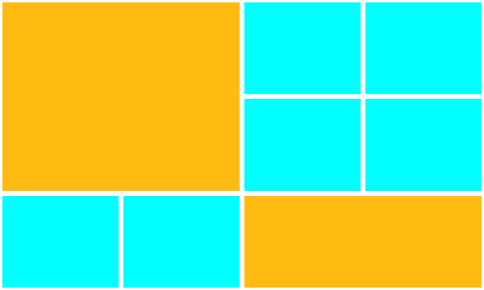

### La gouttière
La gouttière, c’est le nom qu’on utilise pour désigner l’espace qui sépare les colonnes.

## Comment créer une grille en CSS ?
Tout passe par la propriété `display`. Après des années de traversé du désert et de hack pour juste créer 3 colonnes et 2 gouttières, vous aller pouvoir mettre en page rapidement avec CSS grid.

Grid est un module CSS très dense parce qu’il a été pensé et mis à jour pour pouvoir faire des mises en page avancées. Dans ce TP, on va se contenter du strict minimum pour pouvoir répondre au besoin le plus courant : aligner des éléments les un à côtés des autres.

### Fonctionnement de CSS Grid
1. On déclare une grille
2. On déclare la taille des gouttières
3. On définit le nombre de colonnes que contient la grille

Pour définir la taille des colonnes, on peut soit utiliser une valeur connue comme `240px`, `25rem`, `5vw`, …

````CSS
.parent {
  display: grid;
  gap: 1rem;
  grid-template-columns: 22.5rem 22.5rem 22.5rem 22.5rem;
}
````

Ici, j’ai défini une grille de 4 colonnes de 22.5rem avec des gouttière de `1rem`.

#### L’unité spécifique pour créer une grille : `fr`
`fr` veut dire fraction. C’est l’unité la plus intéressante parce que qu’on a plus de calcul à faire par rapport à la taille de l’écran. C’est le navigateur qui va créer les colonnes en fonction du nombre de `fr` qu’on a déclaré.
`1fr` veut dire que les éléments de la grille vont occuper une fraction de la place disponible.

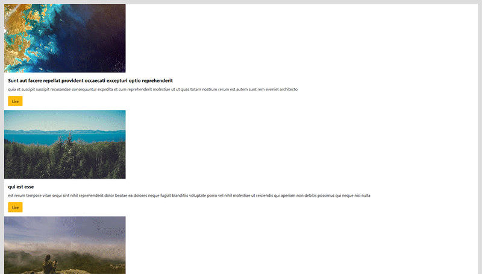

#### `repeat()` à la rescousse
Bon, écrire x fois `1fr`, ça peut vite devenir pénible. C’est pourquoi est sorti l’outil `repeat()`. Il permet de spécifier :
Combien de colonne on souhaite
Quelle est leurs tailles

````CSS
.parent {
  display: grid;
  gap: 1rem;
  grid-template-columns: repeat(4, 1fr);
}
````

Ici, je demande une grille de 4 colonne qui occupent une fraction de la place disponible.

#### Un grille responsive avec 1 ligne de code et sans media-queries ? WHAT ?!
##### Auto-fit et minmax
Voilà une grille parfaitement responsive sans aucune media querie.

````CSS
.parent {
  display: grid;
  gap: 1rem;
  grid-template-columns: repeat(auto-fit, minmax(320px, 1fr));
}
````

Décodons un peu. Puisque nous concevons des interfaces qui doivent s’adapter en fonction de la place disponible, définir un nombre de colonnes n’est pas une stratégie optimisée. En effet, il va falloir redéfinir la grille au fur et à mesure que la taille de l’écran s’agrandit via des média-queries.

Donc la solution la plus élégante consiste à dire au navigateur :
> Cher navigateur, je veux une grille où les éléments font minimum 320px et maximum 1fr (minmax). Si tu as la place, ajoutes des colonnes, sinon rempli l’espace disponible (auto-fit).

Magique non ?

## CSS Flexbox
Flexbox est un modèle de mise en page à 2 sens : vertical et horizontal. Il est aussi très complet donc on se contentera ici aussi du minimum à savoir.

### Pourquoi CSS grid ET flexbox ?
C’est une bonne question, merci de la poser. Chacun a été créer pour une utilisation spécifique. On va utiliser grid pour créer une grille sur laquelle on va faire rentrer des éléments. Pour flexbox, le but est de laisser le contenu s’agencer lui-même tout en étant très précis sur la façon de s’aligner, de s’agrandir ou de se rétrécir.

Pour résumer, si vous avez l’interface de Netflix à recréer, CSS Grid sera plus adapté pour faire la grille du catalogue. Pour les cartes avec la miniature, flexbox sera plus adapté pour faire le job.

### Revenons à flexbox
Il se déclare comme ça
````CSS
.parent {
  display: flex;
}
````
Dès que vous avez déclaré ça, le navigateur va placer tous les éléments sur la même ligne, quitte à placer une barre de scroll horizontal. Par défaut, le navigateur ne s’autorise pas à aller à la ligne. Si besoin, on peut lui donner la permission.
````CSS
.parent {
  display: flex;
  flex-wrap: wrap;
}
````

### Flex comme… flexible
Avec flexbox, on peut définir une taille et aussi dire comment le navigateur doit s’adapter quand il manque de place ou s’il en a trop.
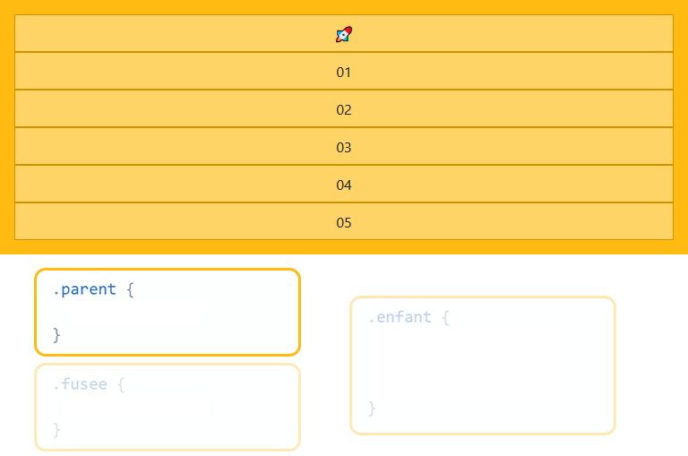

- `flex-basis` remplace width.
- `flex-shrink` définie comment l’élément doit rétrécir s’il manque de place.
- `flex-grow` définie comment l’élément doit s’agrandir s’il y a un surplus de place.

Pour `flex-shrink` et `flex-grow`, plus la valeur est importante, plus le navigateur donnera la priorité à l’élément pour s’agrandir ou se rétrécir selon le contexte.


### L’alignement des éléments

On peut gérer l’alignement des éléments avec
`justify-content` : Gère l’alignement sur axe principal
`align-items` : Gère l’alignement sur l’axe secondaire
`margin-top` et `margin-bottom` sur les enfants pour l’axe vertical

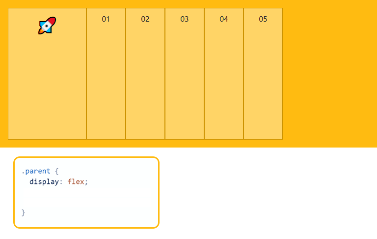

#### Axe principal et secondaire
L’axe principal est définie par `flex-direction`. Sa valeur par défaut (`row`) définie l’axe principal à l’horizontal. Donc l’axe secondaire est l’axe vertical
Par contre, si je change `flex-direction` en `column`, cela s’inverse. L’axe principal devient l’axe vertical.

#### Astuce et simplification
Pour l’alignement vertical, il vaut mieux privilégier la solution `margin` sur les enfants. Comme ça vous n’avez plus qu’à gérer l’axe horizontal.

### Changer de direction
Comme je l’ai dit dans l’intro, _flexbox_ gère aussi bien le sens vertical qu’horizontal. Grâce à `flex-direction`, on peut passer en mode “colonne”

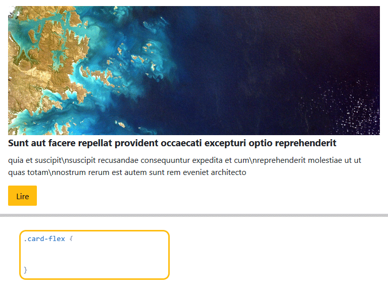

Vous remarquez qu’avec la valeur `column`, c’est la même chose que lorsque l’élément n’était pas en `display: flex`. Donc quel intérêt ?

L’intérêt principal, c’est que maintenant qu’on a un élément flexible. On va pouvoir profiter de la puissance d’alignement vu au-dessus. Le contenu n’a pas toujours la même hauteur.
Prenons un exemple concret. Ici, j’ai une grille où les enfants ne sont pas en `display:flex`
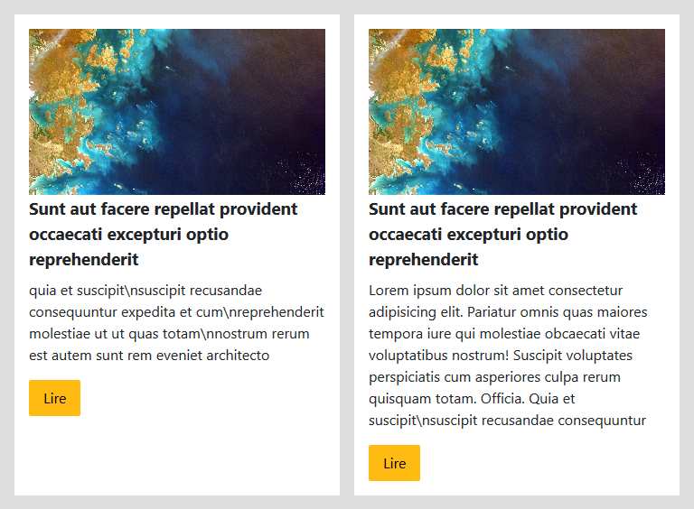

Vous voyez le soucis ? Les boutons ne sont pas alignés. Grâce à flexbox, on va placer le bouton en bas de la carte, quelle que soit la longueur du contenu.
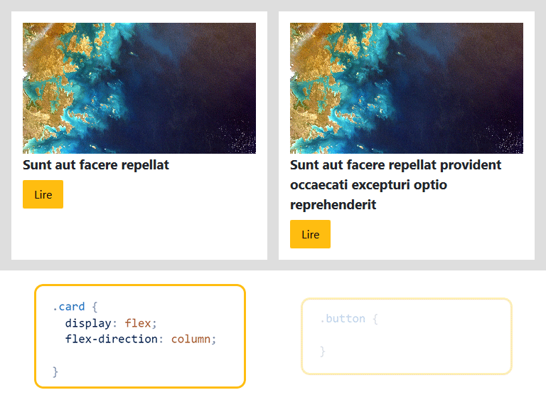

