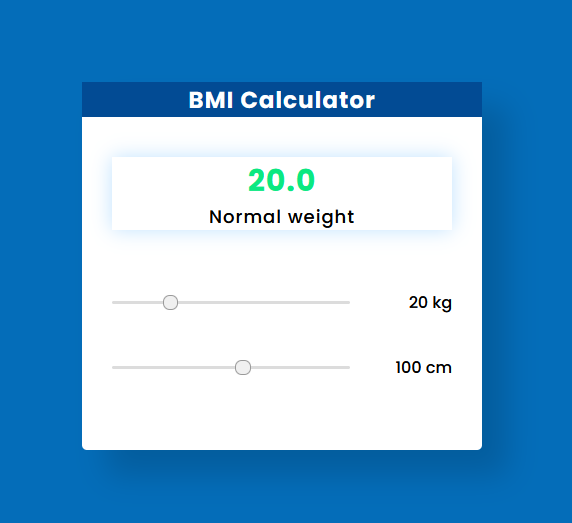
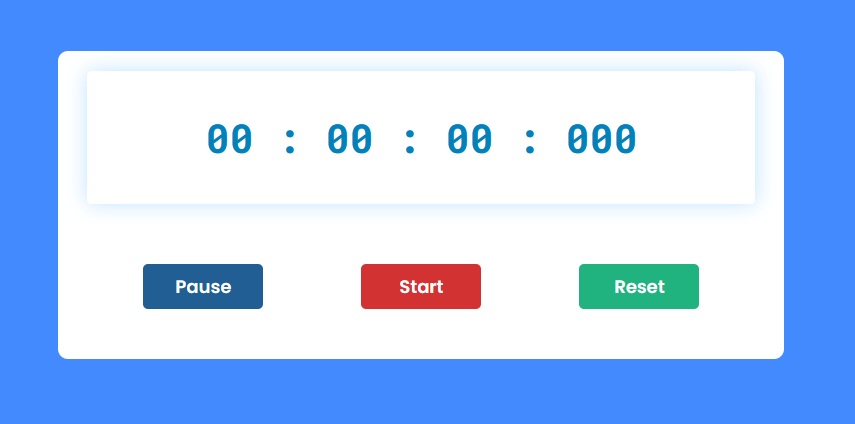
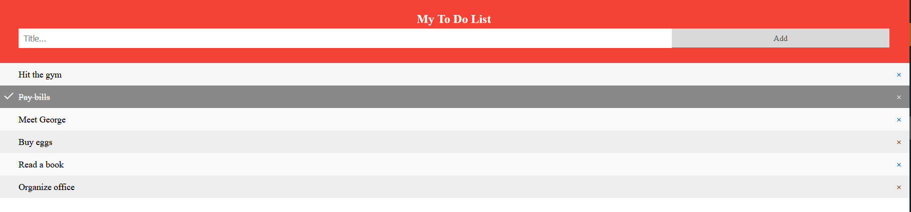
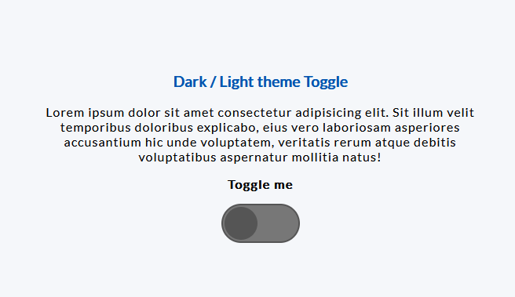
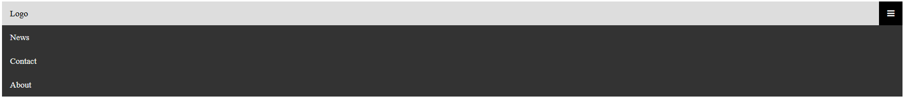
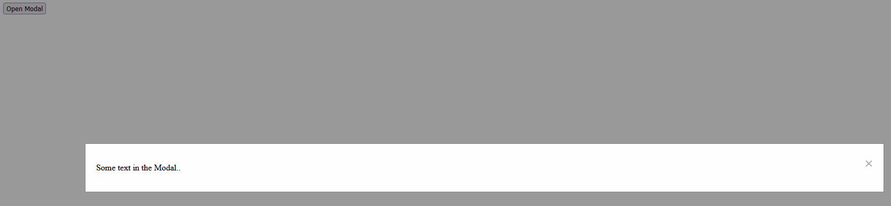
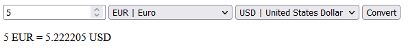
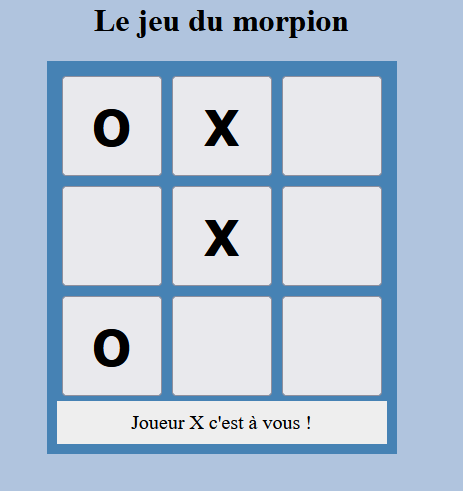
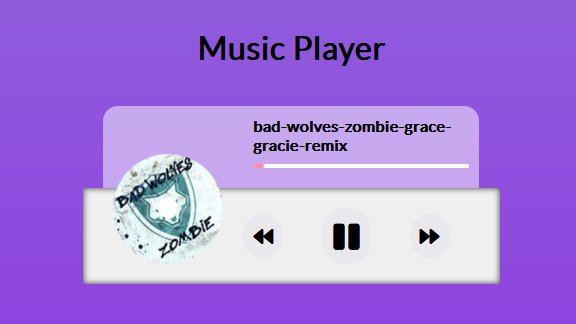

# Exerice simple

- [Exercice 1](exercice_1.md)
- [Exercice 2](exercice_2.md)
- [Exercice 3](exercice_3)

---

# Jeux d'apprentissage

- JSRobot : <https://lab.reaal.me/jsrobot/>
- Elevator Saga : <https://play.elevatorsaga.com/>
- Crunchzilla : <https://www.crunchzilla.com/game-maven>
- Codewars : <https://www.codewars.com/join?language=javascript>
- JSDares : <https://jsdares.com>

---

# Projet - LVL 1

## Calculatrice [IMC]



Ici, nous proposons de résoudre une application Web capable de calculer l'indice de masse corporelle (IMC) de l'internaute, en fonction de sa taille et de son poids.

[Number MDN](https://developer.mozilla.org/fr/docs/Web/JavaScript/Reference/Global_Objects/Number)
[Math MDN](https://developer.mozilla.org/fr/docs/Web/JavaScript/Reference/Global_Objects/Math)

<details>
  <summary>Spoiler warning</summary>


> parseInt() - Math.pow() - if...else if

[Solution](../%E2%9A%A0%EF%B8%8F%20Correction%20%E2%9A%A0%EF%B8%8F/CalculatriceIMC/index.html)
</details>

## Compte à rebours [chronomètre]


Un chronomètre est utilisé pour mesurer le temps qui s’écoule entre son activation et sa désactivation. Il permet de mesurer le temps pris pour une activité spécifique.

[Gestion du délai d’exécution en JavaScript avec setTimeout() et setInterval()](../Cours/delaiExecution.md)

<details>
  <summary>Spoiler warning</summary>

> setInterval() - clearInterval()

[Solution](../%E2%9A%A0%EF%B8%8F%20Correction%20%E2%9A%A0%EF%B8%8F/Chronometre/index.html)
</details>

## TODO List



Une Todo List est principalement utilisé pour organiser n’importe laquelle de vos informations. Ici, vous pouvez créer une liste de nombreux textes que vous voulez faire plus tard. Une fois que vous avez fait cela, vous pouvez les supprimer. Il peut essentiellement servir de routine quotidienne.

<details>
  <summary>Spoiler warning</summary>

> createElement() - createTextNode() - appendChild()

[Solution](../%E2%9A%A0%EF%B8%8F%20Correction%20%E2%9A%A0%EF%B8%8F/TODOList/index.html)
</details>
<br>

> À partir du résultat de l’exemple précédent, vous stockez les données sur localStorage

## Basculement en mode CLAIR/SOMBRE



Vous avez jamais vu un site Web qui vous permet de basculer entre un thème clair et sombre à la demande. Comment vous pouvez mettre en œuvre cette fonctionnalité sur votre site Web ?

[Solution](../%E2%9A%A0%EF%B8%8F%20Correction%20%E2%9A%A0%EF%B8%8F/CLAIR_SOMBRE/index.html)

---

# Projet - LVL 2

## Effets d’animation de pluie simples


Ce type d’effet de pluie animés est utilisé en arrière-plan de différents projets ou éléments. La couleur noire de l’arrière-plan de la page Web a été utilisée pour créer cette pluie d’animation CSS. Alors le point de l’eau blanche tombe de haut en bas. Bien que JavaScript a été utilisé pour le faire fonctionner.

[Solution](../%E2%9A%A0%EF%B8%8F%20Correction%20%E2%9A%A0%EF%B8%8F/PluieAnimation/index.html)

## Les yeux animés suivent le curseur de la souris


L’animation joue un rôle important pour rendre une page Web attrayante. Deux yeux ont été faits ici. Ces deux yeux suivront votre curseur de souris. Ici, l’œil sera au même endroit, mais le point oculaire changera de position.

[Solution](../%E2%9A%A0%EF%B8%8F%20Correction%20%E2%9A%A0%EF%B8%8F/YeuxAnimesSouris/index.html)

## Formulaire avec vérification


Ce n'est pas tout d'envoyer des données, il faut aussi s'assurer que les données mises dans un formulaire par un utilisateur sont dans un format correct pour pouvoir être traitées correctement et qu'elles ne vont pas casser nos applications. Nous voulons également aider les utilisateurs à compléter les formulaires correctement et à ne pas ressentir de frustration en essayant d'utiliser les applications. La validation des données de formulaire vous aide à remplir ces objectifs.

> Il faut garder à l'esprit que le JavaScript est facilement désactivable dans les paramètres des navigateurs et par conséquent, ce langage ne permet pas une réelle sécurité. C'est la même chose pour les CAPTCHAS codés en JavaScript. Il faudra dans ce cas privilégier une sécurisation de formulaire avec le langage PHP. Cependant, ces petits contrôles JavaScript permettent dans bien des cas d'éviter les problèmes de saisie qui ne sont pas forcément malveillants, mais plutôt causés par des étourderies de saisies

[Solution](../%E2%9A%A0%EF%B8%8F%20Correction%20%E2%9A%A0%EF%B8%8F/FormulaireVerification/index.html)

## Horloge avec alarmes


Imaginez une horloge permettant de montrer l’heure à vos utilisateurs, sur un site de voyage par exemple avec le fuseau horaire du pays de destination

[Solution](../%E2%9A%A0%EF%B8%8F%20Correction%20%E2%9A%A0%EF%B8%8F/HorlogesAlarmes/index.html)

## Menu burger



Un menu hamburger est une fonctionnalité classique de l’interface utilisateur présente dans d’innombrables sites Web. Il est utilisé pour afficher et masquer un menu sur clic, en particulier utilisé dans la conception mobile.

[Solution](../%E2%9A%A0%EF%B8%8F%20Correction%20%E2%9A%A0%EF%B8%8F/MenuBurger/index.html)

# Projet - LVL 3

## Comment faire pour créer une fenêtre modale ?



Nous allons nous intéresser à un composant incontournable dans une application Web : La fenêtre modale

[Solution](../%E2%9A%A0%EF%B8%8F%20Correction%20%E2%9A%A0%EF%B8%8F/FenetreModal/index.html)

## Convertisseur de devises [API]



Nous allons implémenter un convertisseur de devises qui convertit simplement la devise dans la devise de n’importe quel autre pays.

[Solution](../%E2%9A%A0%EF%B8%8F%20Correction%20%E2%9A%A0%EF%B8%8F/ConvertisseurDevises/index.html)

## Le Morpion



Dans ce défi, vous allez créer un jeu de morpion. Voici un résumé des règles :

- le jeu se joue sur une grille de 3 carrés sur 3.
- un joueur joue avec le symbole "X" et l'autre avec le symbole "O".
- les joueurs jouent à tour de rôle. Durant son tour, un joueur doit placer son symbole dans un carré vide.
- si un joueur a trois de ses symboles alignés sur une ligne, une colonne ou une diagonale, il gagne le jeu.
- si il ne reste plus de carré vide, et qu'aucun joueur n'a gagné, alors le jeu est déclaré nul.

[Solution](../%E2%9A%A0%EF%B8%8F%20Correction%20%E2%9A%A0%EF%B8%8F/LeMorpion/index.html)

## Lecteur multimédia



HTML5 fournit des éléments pour intégrer du multimédia dans les documents `<video>` et `<audio>` et qui viennent avec leurs propres APIs pour contrôler la lecture, se déplacer dans le flux.. Comment réaliser les tâches les plus communes, comme créer des contrôles de lectures personnalisés.

[Solution](../%E2%9A%A0%EF%B8%8F%20Correction%20%E2%9A%A0%EF%B8%8F/LecteurMultimedia/index.html)

## Pong (Breakout)


Il faut créer un jeu complet de style Breakout. Le HTML Canvas fournit le conteneur de jeu où nous dessinons des graphiques via JavaScript. Après avoir appris à utiliser la toile pour les graphiques et les animations, nous passons par les algorithmes derrière les collisions en utilisant des formes de base comme les cercles et les rectangles. Avec ces concepts et une pincée de boucles de jeu et de son, nous aurons bientôt un jeu prêt à être joué! <https://developer.mozilla.org/fr/docs/Games/Tutorials/2D_Breakout_game_pure_JavaScript>

[Solution](../%E2%9A%A0%EF%B8%8F%20Correction%20%E2%9A%A0%EF%B8%8F/Pong/index.html)

## Carrousel image [Slider]


Il ne fait aucun doute que les carrousels sont des éléments essentiels dans la conception d’un site Web. Lorsque vous êtes limité dans l’espace, mais que vous souhaitez toujours afficher beaucoup d’informations, les carrousels sont très pratiques car ils sont parfaits pour afficher des groupes de contenu connexe ou non. Que ce soit pour le rendu d’un diaporama, d’une section de témoignages ou pour la présentation de plusieurs messages dans un curseur, les carrousels sont indispensables.

[Solution](../%E2%9A%A0%EF%B8%8F%20Correction%20%E2%9A%A0%EF%B8%8F/CarrouselImage/index.html)

## Stripe Follow Along Dropdown


Il y a quelques semaines, stripe.com a lancé un nouveau design de site Web. Il semble génial. Une chose que nous recherchons en particulier est le menu déroulant de navigation de morphing : au lieu de cacher et d’afficher un nouveau « conteneur » lorsque l’utilisateur passe d’un élément de navigation à l’autre, ils animent l’arrière-plan du menu déroulant pour faire de l’espace pour différentes tailles de contenu.

[Solution](../%E2%9A%A0%EF%B8%8F%20Correction%20%E2%9A%A0%EF%B8%8F/StripeFollowAlongDropdown/index.html)


## Lister les dépôts d’un utilisateur GitHub en utilisant l’API publique GitHub
GitHub est une plateforme très essentielle dans le processus de développement logiciel, que ce soit pour les logiciels open-source, les outils privés, l’intégration continue, ou n’importe lequel de ses nombreux autres cas d’utilisation. Dans cette exercice, vous apprendrez à utiliser l’API fetch avec l’interface de programmation d’application GitHub.

Créez un écran avec un `<input>` qui doit recevoir le nom d’utilisateur dans Github. Après avoir entré le nom de l’utilisateur et cliqué sur le bouton Rechercher l’application, vous devez chercher dans l’API de Github (comme URL ci-dessous) les données des dépôts de l’utilisateur et les afficher à l’écran : URL d’exemple : https://api.github.com/users/Myogamevideo/repos Il suffit de changer "Myogamevideo" par le nom de l’utilisateur.

```html
<input type="text" name="user">
<button>Ajouter</button>
```

Après avoir rempli l’entrée et l’ajout, la liste suivante doit apparaître ci-dessous:

```html
<ul>
 <li>repo1</li>
 <li>repo2</li>
 <li>repo3</li>
 <li>repo4</li>
 <li>repo5</li>
</ul>
```
 
À partir du résultat de l’exemple précédent, ajoutez un indicateur de chargement à l’écran à la place de la liste uniquement lorsque la requête est en cours :

```js
<li>Chargement...</li>
```

Ajoutez également un message d’erreur à l’écran si l’utilisateur n’est pas présent sur Github. 

> Astuce : Si l’utilisateur n’existe pas, la requête tombera sur .catch avec code d’erreur 404.

---

# Projet - LVL 4

## Clone de YouTube

Nous utiliserons l’API youtube pour récupérer des données réelles sur youtube. Toutes les données vidéo proviennent de youtube directement. Nous avons une barre de recherche de travail qui redirige l’utilisateur vers la page de recherche officielle youtube. Et chaque fois que l’utilisateur clique sur la carte vidéo, il / elle sera redirigé vers la page vidéo officielle de youtube.

## Clone de Google Maps

Un simple clone de Google Maps utilisant l’API MapBox.

## Native Speech Recognition

L’API JavaScript Speech Recoginition (ou aussi Voice API) nous permet d’accéder au microphone du visiteur et d’intercepter et d’évaluer les entrées vocales. Et avec elle quelques choses intéressantes peuvent être mises en œuvre : Cela peut même aller aussi loin que votre propre IA! Ou vous construisez votre propre Amazon Echo (Alexa)? Vous avez toutes les possibilités.

## Jeu vitesse d'écriture

Un test de dactylographie est conçu pour déterminer à quelle vitesse une personne tape dans un laps de temps donné. Nous allons concevoir un jeu de frappe utilisant JavaScript qui présente un défi de frappe simple et trouve les performances de frappe en calculant les caractères par minute (CPM), les mots par minute (WPM) et la précision des caractères saisis.

## Learn JavaScript by Building 7 Games - Full Course

- <https://www.youtube.com/watch?v=ec8vSKJuZTk>

## Create Video Games [Phaser.JS]

## Algorithmes et Structures de Données en JavaScript

- <https://www.freecodecamp.org/news/data-structures-in-javascript-with-examples/>
- <https://github.com/trekhleb/javascript-algorithms/blob/master/README.fr-FR.md>

## Création de particules [AnimeJS] [Particles.js] [VanillaJS]

## Parallax Website
