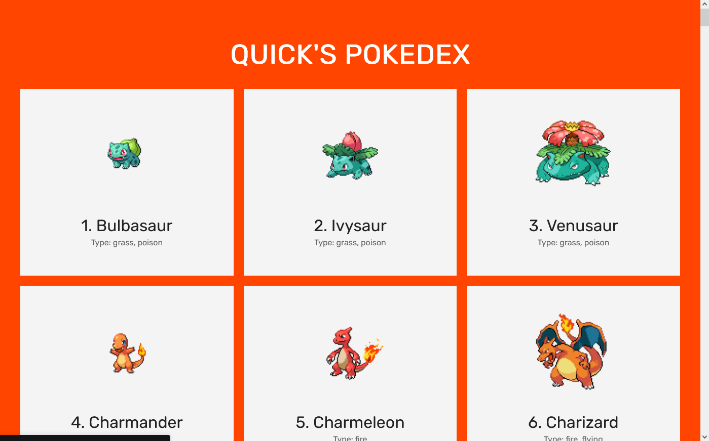

# QCM [Exo 0] - Sur feuille - 8:40 à 10h10 [1H30]

## 17 questions de cours - 90 sec chacune


# Exercice les bases de JS [Exo 1] - Sur feuille - 8:40 à 10h10 [1H30]


## Q1  

Créer une fonction qui compte tenu de l’objet suivant:

```js
var adresse = {
  rue: "Rue des gras",
  numéro : 42,
  quartier : "Centre ville",
  ville : "Clermont-Ferrand",
  pays : "France"
};
```

Retourner le contenu suivant:
L’utilisateur habite en France, dans le quartier Centre ville, sur la rue "Rue des gras" avec nº 42.

## Q2

Créer une fonction qui donne un intervalle (entre x et y) affiche tous les nombres pairs:

```js
function paires(x, y) {
// code ici
}
paires(32, 321);
```

## Q3

Saisissez une fonction qui vérifie si le tableau de compétences passé possède la capacité "Javascript" et retourne un booléen true/false s’il existe ou non.

```js
fonction habilite(skills) {
// code ici
}
var skills = ["Javascript", "Reactjs", "React Native"];
habilite(skills); // true ou false
```

> Astuce : pour vérifier si un vecteur contient une valeur, utilisez la méthode indexOf.

## Q4

Écrivez une fonction qui donne un total d’années d’étude renvoie à quel point l’utilisateur est expérimenté:

```js
function experience(années) {
// code ici
}
var anneeEtude = 7;
experience(anneeEtude);
// De 0-1 an : Débutant
// de 1 à 3 ans : Intermédiaire
// de 3 à 6 ans : Avancé
// De 7 ci-dessus : Maître Jedi
```

## Q5

Compte tenu du vecteur d’objets suivant:

```js
var user = [
{
    nom : "Corentin",
    compétences : ["Javascript", "Reactjs", "Redux"]
},
{
    nom : "Gabriel",
    compétences : ["Vuejs", "Ruby on Rails", "Elixir"]
}
];
```

Écrivez une fonction qui produit le résultat suivant:

Corentin possède les compétences : Javascript, Reactjs, Redux Gabriel possède les compétences : Vuejs, Ruby on Rails, Elixir

> Astuce : Pour parcourir un vecteur, vous devez utiliser la syntaxe for...of et pour fusionner les valeurs d’un tableau avec un séparateur, utilisez join.

# Pokedex JS [Exo 2] - Sur feuille - 10:40 à 12h40 [2H]


## Objectif de cette exercice

Pokédex en javascript en utilisant PokéApi.

## Liste des différents pokémons



## Vous pouvez rechercher votre pokémon préféré


## Exemple - Détail d'un pokémon

```js
POKEMON { id : 1, name : blastoise, type : water, height: 1.6m , weight: 85.5 kg }
```

<details>
  <summary>Spoiler warning</summary>

Les fonction JS :

- fetch
- querySelector*
- getElement*
- new class
- new object
- console.log
- innerHTML
- createElement
- appendChild
- ...

> PokéApi [The RESTful Pokémon API] : <https://pokeapi.co/>


</details>

# BINOUZEEE AVEC LE CHEF