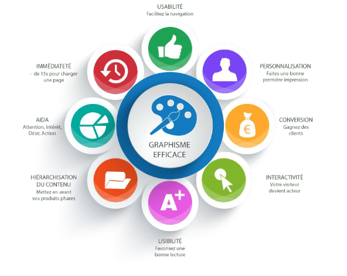

# Cours Maquettage 1
Avoir un site web pour son entreprise ou sa marque, c’est bien. Mais un site qui met en avant les valeurs, la marque et l’identité de l’entreprise, c’est mieux. Pour y arriver, il vous faut un UI design de qualité. La maquette d’un site se fait en plusieurs étapes et par des professionnels. Pour cela, découvrez ci-dessous toutes les informations relatives à la réalisation d’une maquette de site web réussie.

## Comprendre l’ergonomie
### Qu’est ce que l’ergonomie ?
Le terme « ergonomie » vient du grec ancien « érgon » qui 
signifie « travail » et « nόmos » qui désigne la « loi ». 
Cela signifie littéralement « connaissance du travail ». 
C’est une discipline scientifique et technique dont la 
pratique a évoluée au fil de l’histoire et des avancées 
technologiques .
L’ergonomie est l’étude scientifique de la relation 
entre l’homme et ses moyens, méthodes et milieux 
de travail. Son objectif est d’élaborer, avec le concours 
des diverses disciplines scientifiques qui la composent, un 
corps de connaissances qui dans une perspective 
d’application, doit aboutir à une meilleure adaptation à 
l’homme des moyens technologiques de production, et 
des milieux de travail et de vie

## Quelques évolutions de l’ergonomie
- 1900-1930 : Étude sur les conditions de travail, la 
prévention, la monotonie,
- 1943 : Courant « Human engineering »- Recherches 
en psychologie expérimentale,
- 1949 : le terme « Ergonomics » est officiellement 
proposé par Murrell,
- 1950-1960 : Etudes centrées sur les postes de travail,
- 1960 : Analyse des postes dans un environnement 
informatisé,
- A partir 1970 : Essor de l’ergonomie informatique 
avec les premiers ordinateurs personnels

## Divers types d’ergonomie
- L’ergonomie physique : elle porte sur les 
problèmes d’adaptation de l’outil aux caractéristiques 
physiologiques et morphologiques de l’être humain
- L’ergonomie cognitive : elle s’intéresse aux 
problèmes d’adaptation de l’outil fonctionnement 
cognitif des utilisateurs
- L’ergonomie des organisations : approche 
davantage centrée sur l’organisation avec par 
exemple l’étude des aménagements horaires de 
travail, le stress ou la gestion des conflits
- https://www.youtube.com/watch?v=G1gMoZ1u_6s

## Divers types d’ergonomie
Lorsqu’il s’agit de l’ergonomie des interfaces, 
l’expérience utilisateur est le critère principal à 
retenir. C’est toute l’importance de l’UX design, 
méthode de conception centrée utilisateur.

## Quelques principes de design
### De la couleur
Qu’est ce que la couleur ?

- Les couleurs sont une perception et une interprétation de notre 
cerveau. Les photons, molécules de la lumière s’agite et crée une 
onde. Cette onde est captée dans nos yeux par les cônes et 
l’information est transmise au cerveau.
- Lorsqu’une lumière blanche frappe une surface, seule une partie des 
couleurs du spectre est renvoyée, le reste est absorbé par la surface. 
La couleur perçue est le résultat des longueurs d’ondes réfléchies.

### Les Couleurs Primaires
Qu’est ce que la couleur ?

https://www.canva.com/fr_fr/decouvrir/couleur-primaire/ 

Comme vu précédemment, la lumière blanche se compose de toutes 
les couleurs visibles, qui forment un spectre infini tel qu’il apparaît 
dans un arc-en-ciel. Pour des raisons de commodité, le cercle 
chromatique restitue cette infinité sous forme de 12 couleurs de base, 
très similaires à celles de votre première boîte de crayons.

### Les Couleurs
### Contraste et accessibilité
Dans le design de sites, produits ou applications, le choix des couleurs 
est important. La couleur peut véhiculer l’identité de votre marque, 
aider les utilisateurs à comprendre l’information, etc. 
Malheureusement, tout le monde ne distingue pas les couleurs 
de la même façon.

https://www.slideshare.net/Boiteaweb/couleurs-accessibilit-blendwebmix-2017

Règle de contrainte d’accessibilité établie par le W3C. Et prise en 
compte par google notamment en matière de référencement Web :

https://www.w3.org/TR/WCAG21/

L’article 1.4 définit les critère d’accessibilité aux personnes ayant des 
déficiences visuelles. L’un des critère et notamment la différenciation 
entre le fond et le contenu.
Le contraste entre les deux doit être assez important. On parlera alors 
de critères AA et AAA

les « petits » textes de moins de 24px (ou les textes en gras de 
moins de 19px) doivent suivre la règle d’un contraste minimum de 
4.5, les textes plus gros de plus de 24px (ou les textes en gras de 
plus de 19px) doivent suivre la règle d’un contraste minimum de 
3.

Quelques outils pour vous aider :
- Toptal est un outil en ligne qui vous permet de  vérifier l’accessibilité de votre site pour différent type de problème de vision : https://www.toptal.com/designers/colorfilter
- Contrast analyser :https://www.tpgi.com/color-contrast-checker/
- Color review : https://color.review/
- Coolors: pour créer un nuancier : https://coolors.co/
- Daltonisme :  https://www.toptal.com/designers/colorfilter

Certaines analyses ont montré que la couleur est un élément qui attire et incite les clients à réagir. Donc l’aspect couleur de votre interface web doit être pris au sérieux. En plus, bien qu’elle ne soit pas objective, la couleur agit sur les émotions et influence les comportements ou les prises de décision. Il est quand même important de connaître les significations de chaque couleur afin de les utiliser.

Vous connaissez la signification de chaque couleur, alors vous pouvez choisir celles de votre interface. En le faisant, vous devez être sûre que les couleurs choisies répondent aux attentes des clients

## La typographie

Les polices d’un site internet expriment les valeurs et l’identité de votre entreprise. C’est un élément important dans l’esprit des visiteurs du site. Tout d’abord, le choix de police pour un site web n’est pas une chose simple pour les graphistes. Un mauvais choix peut ne pas attirer d’audience. Il faut que cette dernière reste lisible.

- https://fonts.google.com/
- https://fontawesome.com/

Pour votre site, vous pouvez utiliser au maximum 3 polices. Il est conseillé de faire référence à Google Fonts pour voir les polices disponibles. Les raisons de ce choix ? En voici quelques-unes :

    Polices Open Source
    Possibilité de télécharger les polices
    Intégration rapide sur un site

Certains critères entrent en ligne de compte pour le choix de la taille des polices. La lisibilité est la plus importante car il faut des textes lisibles et aérés ; une résolution adaptée au type d’écran. Ensuite, nous avons la flexibilité et la diversité qui sont très utiles pour la hiérarchisation des pages du site.

Enfin, la compatibilité qui permet aux polices de votre site de garder leur qualité sur n’importe quel navigateur ou système d’exploitation.

## Le Rythme
### Le rythme (mouvement et temps)
Le rythme est l'utilisation d'éléments d'une conception visuelle répéter . 
Répétition des éléments de conception , telles que les formes, les lignes ou 
de couleurs , attire l' œil du spectateur d'une partie de l'ouvrage à l'autre 
d'une manière cadencée . Rythme peut créer un sentiment d'ordre et un 
sens du mouvement .

https://www.greelane.com/fr/science-technologie-math%C3%A9matiques/linformatique/rhythm-design-principle-3470054/

## Resource
### Les images
- https://unsplash.com/images
- https://pixabay.com/fr/
- https://www.pexels.com/fr-fr/
- https://fr.freepik.com/
### Les logiciels de création graphique en ligne
- https://www.canva.com/
- https://pixteller.com/
### Plus d’idée
- https://graphiste.com/blog/
- https://dribbble.com/
- https://www.awwwards.com/

## Quelques principe d’ergonomie
### Ergonomie Cognitive

- Apprentissage

Facilité 
l’action des 
gens en 
harmonisant 
le 
fonctionnem
ent du site.
- Communication

Le site doit 
ou 
l’application 
doit 
communique
r avec les 
gens.
- Clarification

Simplifier et 
clarifier au 
maximum 
l’interface

## Structuration des contenus

Vous devez faciliter la navigation sur votre site aux internautes. L’objectif est d’aider l’internaute à comprendre rapidement vos produits/services et simplifier les actions qu’il a à faire. Pour cela, ses différentes parties doivent être bien structurées.

– Le parcours utilisateur

Il se définit comme le chemin que le client adopte entre son besoin et la finalité. Cette dernière n’est autre que l’achat du produit. Le parcours utilisateur s’achève au niveau de la consommation du produit. Et, si possible, des services après-vente.

– Arborescence

L’arborescence d’un site désigne une structure et une organisation des pages de votre site web. Elle donne une vision globale du site en classant en mode graphique les contenus proposés. L’arborescence commence par la page d’accueil et se décline en rubrique (catégorie et sous-catégorie) et enfin en article, en fiche produit, en forum, selon les objectifs du site.

– Hiérarchisation de l’information

Elle consiste à faire le classement des informations du site selon leur importance. Par exemple, pour un produit, les designers doivent mettre en avant les caractéristiques de ce dernier avant de penser à publier les avis des consommateurs.

### UX-design
L’UX design ou User Expérience Design est une discipline 
permettant d’augmenter les performances d’un site web ou d’une 
application mobile en le rendant parfaitement conforme aux attentes 
des utilisateurs. Comment créer un site internet ou une application mobile 
qui réponde parfaitement aux besoins des visiteurs ?

## Combien coûte une maquette graphique ?
Le prix de maquettes varie selon le travail. L’interface de votre site internet intègre certains éléments comme la marque, les photos, les images et les mises en page. Avec un site simple vous pouvez débourser entre 500 € et 1500 €. Pour avoir un site complexe avec plus d’éléments, il vous faut un budget plus élevé.

## A quoi sert le webdesign d’une maquette ?

Cette étape se nomme UI design (user interface design) et consiste à compléter le travail d’UX design déjà existant. En effet, la mission du webdesigner est de créer une interface à la fois agréable, pratique et facile à prendre en main.

C’est lui qui va faire le choix de mettre en valeur tel ou tel élément (par la couleur par exemple) et d’induire telle ou telle fonctionnalité (par la forme par exemple). Son objectif est de donner la meilleure expérience utilisateur possible, afin de susciter l’émotion la plus positive auprès de son audience.

Notre conseil : commencez par réaliser la mise en page de la page d’accueil. C’est souvent elle qui contient le plus d’éléments différents, ce qui vous permet de réfléchir à beaucoup de cas de figures graphiques assez rapidement.

Vous serez ainsi paré pour réaliser les autres pages en vous en inspirant (voire même en copiant certains blocs… mais c’est un secret entre vous et nous).

Encore une fois, il vaut mieux faire ces choix graphiques (et parfois des erreurs) lorsque vous êtes en train de créer la maquette de votre site internet, plutôt qu’au moment de son développement.

## Conclusion :
Vous pouvez passer au webdesign de votre site internet ! Vous avez en main tous les éléments constitutifs de votre site, au tour du design graphique de rentrer en jeu.

A l’aide de l’identité visuelle de votre marque ou de votre entreprise (notamment son logo), et plus précisément de son cahier des charges, vous allez maintenant donner formes et couleurs aux pages de votre maquette web.

Définissez les éléments que vous allez utiliser :

    les couleurs
    les éléments graphiques
    la ou les polices de caractères (ou caractères typographiques)
    le type de photos ou d’illustrations et leur traitement graphique
    plus généralement tout ce qui fait l’esthétique de votre site (la forme des boutons, le choix des icônes, la forme des blocs, la forme des formulaires de contact, etc.)

Mon conseil : attribuez une couleur à chaque fonction ! Les boutons devront avoir une teinte similaire, de même que les formulaires ou icônes. Cette bonne pratique assure une cohérence dans la navigation des visiteurs, tout en donnant un aspect professionnel à votre e-commerce.

Concernant la typographie, assurez-vous que les polices sélectionnées sont :

    Lisibles sur tout type d’écran
    Compatibles avec tous les navigateurs et systèmes d’exploitation
    Flexibles pour les décliner, si besoin (gras, italique, semi-gras…)
 

Ne vous éparpillez pas et respectez bien ces choix que vous faites dès le départ. Toutes les pages de votre maquette doivent avoir la même identité graphique !

Pour vous y aider, la recherche de références graphiques (notamment le travail de web-designer ou de graphistes expérimentés) et la création de moodboards sont souvent d’une grande aide. Sans pour autant les plagier, n’ayez pas peur de vous inspirer de bons webdesign.

C’est comme cela qu’on apprend !