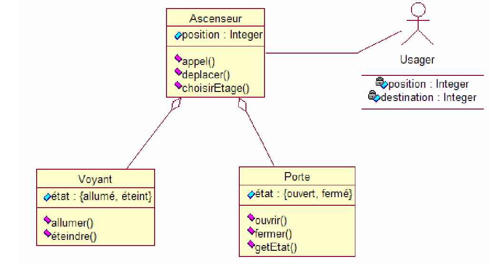
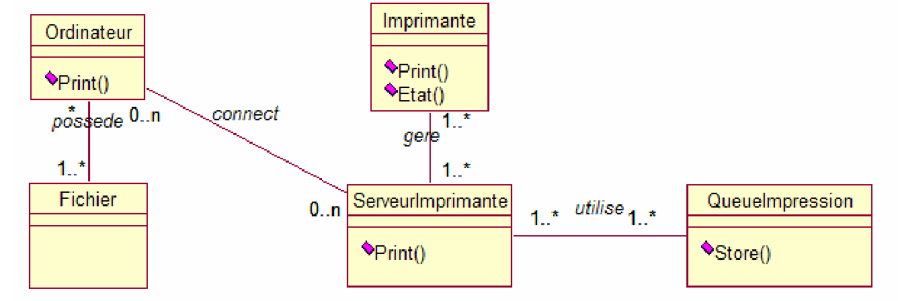

# Qu'est-ce qu'un diagramme de communication ?

- Vidéo d'explication : <https://youtu.be/atggumWX7GA?t=1206>

Un diagramme de communication offre les mêmes informations qu'un diagramme de séquence, mais alors qu'un diagramme de séquence met l'accent sur l'heure et l'ordre des événements, un diagramme de communication met l'accent sur les messages échangés entre les objets d'une application. Les diagrammes de séquence peuvent ne pas offrir la "vue d'ensemble".

C'est là que les diagrammes de communication entrent en jeu et offrent cette perspective plus large au sein d'un processus.

# Composants de base d'un diagramme de communication

Les diagrammes de communication offrent des avantages similaires aux diagrammes de séquence, mais ils offrent une meilleure compréhension de la façon dont les composants communiquent et interagissent les uns avec les autres plutôt que de mettre uniquement l'accent sur la séquence des événements. Ils peuvent constituer une référence utile pour les entreprises, les organisations et les ingénieurs qui ont besoin de visualiser et de comprendre les communications physiques au sein d'un programme. Essayez de dessiner un diagramme de séquence pour :

- Modélisez la logique d'une procédure, d'une fonction ou d'une opération sophistiquée.
- Identifiez comment les commandes sont envoyées et reçues entre les objets ou les composants d'un processus.
- Visualisez les conséquences d'interactions spécifiques entre différents composants d'un processus.
- Planifiez et comprenez les fonctionnalités détaillées d'un scénario existant ou futur.

# Symboles et notations des diagramme de communication

Les symboles et les notations utilisés dans les diagrammes de communication sont les mêmes notations pour les diagrammes de séquence.

- Les rectangles représentent les objets qui composent l'application.
- Les lignes entre les instances de classe représentent les relations entre les différentes parties de l'application.
- Les flèches représentent les messages qui sont envoyés entre les objets.
- La numérotation vous permet de savoir dans quel ordre les messages sont envoyés et combien de messages sont nécessaires pour terminer un processus.

# Exemple de diagramme de communication

Dans l'exemple ci-dessous, le diagramme de communication explique le processus d'ajout d'un événement à un calendrier. Même dans des exemples simples comme celui-ci, vous remarquerez que les commandes et les demandes exactes sont partagées entre les différentes étapes du processus. Les chiffres sur chaque ligne représentent l'ordre et les options dans lesquels ils sont activés. Nous savons que certaines actions se produisent simultanément en raison de l'utilisation de lettres.

<!-- 
http://exercicecorrige.blogspot.com/2013/08/ascenseur_31.html
-->
# Exerice 1

Décrire par un diagramme de communication le fonctionnement d'un ascenseur (une personne appuie sur un bouton, l'ascenseur arrive, les portes s'ouvrent, la personne entre...).

  
Spoiler warning

<!--
http://niedercorn.free.fr/iris/iris1/uml/umltd4.pdf
-->

# Exercie 2

A partir du diagramme de classe ci-dessus :

Rédigez un diagramme de collaboration à partir du diagramme de classe obtenu à la question 1.

<!--
http://exercicecorrige.blogspot.com/2013/08/bureau-de-poste.html
-->

# Exerice 3

A la poste, les personnes arrivent dans une file d'attente. Avec deux guichets, décrire par un diagramme de collaborations l'arrivée, l'attente et la prise en charge des personnes.
