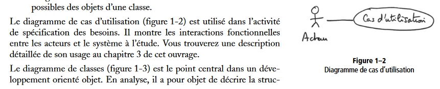
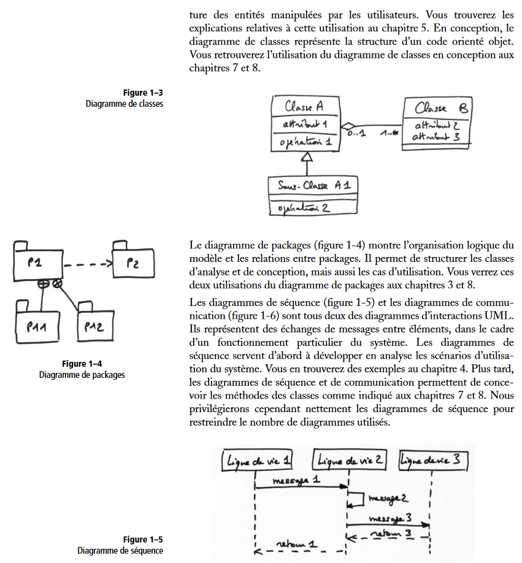
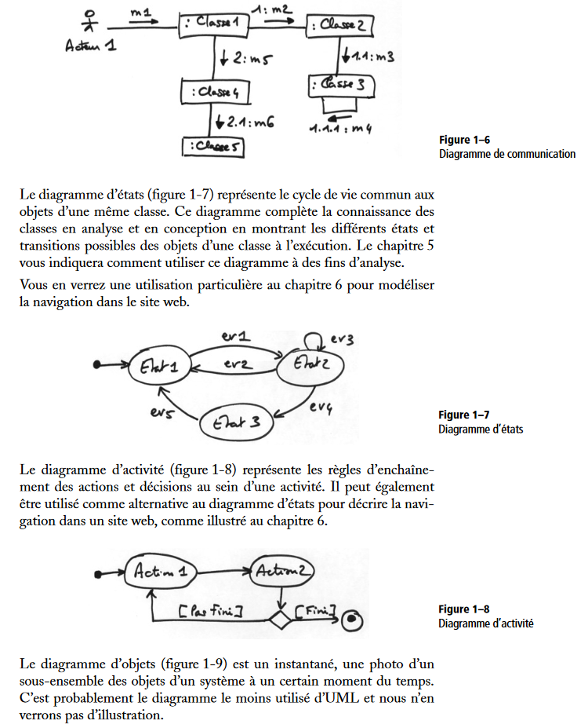
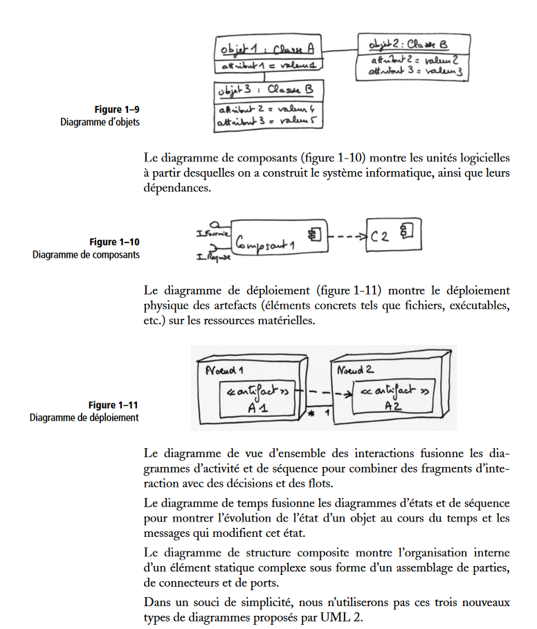
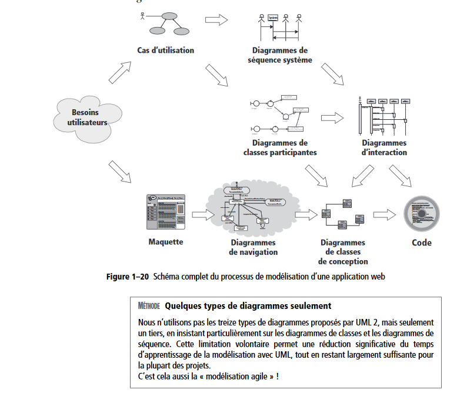

# Qu'est-ce que le langage UML ?

Le langage UML (Unified Modeling Language, ou langage de modélisation unifié) a été pensé pour être un langage de modélisation visuelle commun, et riche sémantiquement et syntaxiquement. Il est destiné à l'architecture, la conception et la mise en œuvre de systèmes logiciels complexes par leur structure aussi bien que leur comportement. L'UML a des applications qui vont au-delà du développement logiciel, notamment pour les flux de processus dans l'industrie.

Il ressemble aux plans utilisés dans d'autres domaines et se compose de différents types de diagrammes. Dans l'ensemble, les diagrammes UML décrivent la limite, la structure et le comportement du système et des objets qui s'y trouvent.

L'UML n'est pas un langage de programmation, mais il existe des outils qui peuvent être utilisés pour générer du code en plusieurs langages à partir de diagrammes UML. L'UML a une relation directe avec l'analyse et la conception orientées objet.

# UML et son rôle dans la modélisation et la conception orientées objet

Il existe de nombreux modèles et paradigmes de résolution de problèmes en science informatique, qui est l'étude des algorithmes et des données. On dénombre quatre catégories de modèles de résolution de problèmes : les langages impératifs, fonctionnels, déclaratifs et orientés objet (LOO). Dans le cas des langages orientés objet, les algorithmes sont exprimés en définissant des objets et en les faisant interagir les uns avec les autres. Ces objets sont des éléments que l'on peut manipuler et qui existent dans le monde réel. Il peut s'agir d'immeubles, de widgets sur un ordinateur ou encore d'êtres humains.

Les langages orientés objet dominent le monde de la programmation parce qu'ils modélisent des objets du monde réel. L'UML combine plusieurs notations orientées objet : Object-Oriented Design (conception orientée objet), Object Modeling Technique (technique de modélisation objet) et Object-Oriented Software Engineering (génie logiciel orienté objet).

L'UML utilise les points forts de ces trois approches pour présenter une méthodologie plus cohérente et plus facile à utiliser. Il représente les meilleures pratiques de création et de documentation des différents aspects de la modélisation des systèmes logiciels et d'entreprise.

# Histoire et origines de l'UML

Les Three Amigos du génie logiciel, comme on les appelait alors, avaient élaboré d'autres méthodologies. Ils se sont associés pour apporter plus de clarté aux programmeurs en créant de nouvelles normes. La collaboration entre Grady, Booch et Rumbaugh a renforcé les trois méthodes et a amélioré le produit final.

Les efforts de ces penseurs ont abouti à la publication des documents UML 0.9 et 0.91 en 1996. Il est rapidement devenu évident que des sociétés comme Microsoft, Oracle et IBM voyaient l'UML comme un élément critique pour leur développement futur. Elles ont donc mis en place des ressources, accompagnées en cela par de nombreuses autres sociétés et personnes, permettant de développer un langage de modélisation complet. Les Three Amigos ont publié The Unified Modeling Language User Guide en 1999, qui fut suivi d'une mise à jour comportant des informations sur l'UML 2.0 en 2005.

# Object Management Group (OMG)

Selon son site Web, [l'Object Management Group® (OMG®)](https://www.omg.org/) est un consortium de normes technologiques international, ouvert à tous et sans but lucratif créé en 1989. Les normes de l'OMG sont appliquées par les entreprises, les utilisateurs, le monde universitaire et les agences gouvernementales. Les groupes de travail de l'OMG développent des normes d'intégration aux entreprises pour un grand nombre de technologies et de secteurs industriels. Les normes de modélisation de l'OMG, dont l'UML et le Model Driven Architecture® (MDA®), permettent la conception, l'exécution et la maintenance de logiciels et d'autres processus d'une façon visuellement efficace.

L'OMG (Object Management Group) supervise la définition et la maintenance des spécifications UML. Cette surveillance donne aux ingénieurs et aux programmeurs la possibilité d'utiliser un langage à des fins multiples pendant toutes les phases du cycle de vie du logiciel, quelle que soit la taille du système concerné.

# Utilité de l'UML selon l'OMG

L'OMG définit les objectifs de l'UML comme suit :

- Fournir aux concepteurs de systèmes, ingénieurs logiciels et développeurs de logiciels des outils pour l'analyse, la conception et la mise en œuvre de systèmes logiciels, ainsi que pour la modélisation de processus métier et d'autres processus similaires.
- Faire progresser l'industrie en permettant l'interopérabilité des outils de modélisation visuelle orientés objet. Toutefois, pour permettre un échange significatif d'informations de modèles entre outils, il est nécessaire de trouver un accord sur la sémantique et la notation.

UML répond aux exigences suivantes :

- Fixer une définition formelle d'un métamodèle basé sur une norme Meta-Object Facility (MOF) commune qui spécifie la syntaxe abstraite de l'UML. La syntaxe abstraite définit l'ensemble des concepts de modélisation UML, leurs attributs et leurs relations, ainsi que les règles permettant d'associer ces concepts afin de créer des modèles UML partiels ou complets.
- Fournir une explication détaillée de la sémantique de chaque concept de modélisation UML. La sémantique définit, d'une façon indépendante de la technologie, comment les concepts UML doivent être mis en œuvre par les ordinateurs.
- Spécifier des éléments de notation lisibles par l'homme pour représenter chaque concept de modélisation UML, ainsi que les règles pour les combiner au sein d'une grande variété de diagrammes correspondant à différents aspects des systèmes modélisés.
- Définir des moyens grâce auxquels les outils UML peuvent être mis en conformité avec cette spécification. Ceci est pris en charge (dans une spécification distincte) par une spécification XML des formats d'échange de modèles correspondants (XMI) qui doivent être réalisés par des outils conformes.

# UML et la modélisation de données

L'UML est prisé par les programmeurs, mais n'est généralement pas utilisé par les développeurs de bases de données. Cela s'explique notamment par le fait que les créateurs de l'UML ne se sont tout simplement pas intéressés aux bases de données. Malgré cela, l'UML est efficace pour la modélisation générale de données et peut être utilisé dans différents types de diagrammes UML.

# Mises à jour d'UML 2.0

L'UML fait l'objet d'améliorations continues. Sa version 2.0 étend ses spécifications pour couvrir davantage d'aspects du développement, y compris le développement agile. L'objectif était ici de restructurer et de perfectionner l'UML afin que son utilisabilité, sa mise en œuvre et son adaptation soient simplifiées. Voici quelques-unes des mises à jour apportées aux diagrammes UML :

- Une plus grande intégration entre les modèles structurels et comportementaux.
- La possibilité de définir une hiérarchie et de décomposer un système logiciel en éléments et sous-éléments.
- UML 2.0 augmente le nombre de diagrammes, qui passe de 9 à 13.

# Glossaire UML

Familiarisez-vous avec la terminologie UML grâce à cette liste tirée du document UML 2.4.1, destiné à aider les personnes non membres d'OMG à comprendre des termes couramment utilisés.

- **Conformité à la syntaxe abstraite** Les utilisateurs peuvent transférer des modèles à travers différents outils, même s'ils utilisent des notations différentes
- **Common Warehouse Metamodel (CWM)** Interfaces standard utilisées pour permettre l'échange de métadonnées d'entrepôt et de BI entre des outils d'entrepôt de données, des plateformes d'entrepôt de données et des référentiels de métadonnées d'entrepôt dans des environnements hétérogènes distribués
- **Conformité à la syntaxe concrète** Les utilisateurs peuvent continuer à utiliser une notation qu'ils connaissent dans différents outils
- **Noyau (Core)** Dans le contexte d'UML, le noyau fait généralement référence au package central, qui est un métamodèle complet tout particulièrement conçu pour pouvoir être réutilisé à grande échelle
- **Unité de langage** Consiste en une série de concepts de modélisation associés entre eux qui donnent aux utilisateurs la possibilité de représenter les aspects du système étudié selon un paradigme ou un format particulier
- **Niveau 0** Le niveau minimal de conformité pour une infrastructure UML - un langage unique qui fournit les types de structures de classes que l'on trouve dans les langages de programmation orientés objet les plus courants
- **Meta Object Facility (MOF)** Une spécification de modélisation OMG qui fournit la base pour les définitions de métamodèles dans la famille de langages MDA d'OMG
- **Métamodèle** Définit le langage et les processus à partir desquels former un modèle
- **Constructions de métamodèles** Deuxième niveau de conformité dans l'infrastructure UML. Il s'agit d'une unité de langage supplémentaire pour des structures de classes plus poussées, utilisées pour créer des métamodèles tels que l'UML lui-même. L'UML n'a que deux niveaux de conformité.
- **Model Driven Architecture (MDA)** Approche et plan permettant de créer un ensemble cohésif de spécifications technologiques définies par un modèle
- **Object Constraint Language (OCL)** Langage déclaratif permettant de décrire des règles qui s'appliquent au langage de modélisation unifié (UML). OCL complète l'UML en fournissant des termes et des symboles d'organigramme qui sont plus précis que le langage naturel, mais moins difficiles à maîtriser que les mathématiques
- **Object Management Group (OMG)** Consortium à but non lucratif de spécifications pour le secteur informatique dont les membres définissent et maintiennent la spécification UML
- **UML 1** Première version du langage de modélisation unifié
- **Langage de modélisation unifié (UML)** Langage visuel permettant spécifier, créer et documenter les artefacts des systèmes
- **XMI** Spécification XML des formats d'échange de modèles correspondants

Voir le document [MOF complet](https://www.omg.org/spec/MOF/2.4.1/PDF/)

# Concepts de modélisation spécifiés par l'UML

Le développement d'un système est axé sur trois modèles de systèmes globaux :

- Fonctionnel : ce sont des diagrammes de cas d'utilisation, qui décrivent la fonctionnalité du système du point de vue de l'utilisateur.
- Objet : ce sont des diagrammes de classes qui décrivent la structure d'un système en termes d'objets, attributs, associations et opérations.
- Dynamique : ce sont des diagrammes d'interaction, diagrammes états-transitions et diagrammes d'activités utilisés pour décrire le comportement interne du système.

On visualise ces modèles de système grâce à deux types distincts de diagrammes : structurel et comportemental.

# Concepts orientés objet dans le langage UML

Les objets dans UML sont des entités du monde réel qui existent autour de nous. Dans le développement de logiciels, les objets peuvent être utilisés pour décrire – ou modéliser – le système en cours de création sous un angle pertinent. Les objets permettent également la décomposition de systèmes complexes en éléments compréhensibles qui permettent de construire les pièces une par une.

Voici quelques concepts fondamentaux d'un monde orienté objet :

- **Objets** Représentent une entité et le module de base
- **Classe** Plan d'un objet
- **Abstraction** Comportement d'une entité du monde réel
- **Encapsulation** Mécanisme qui consiste à relier les données et à les cacher du monde extérieur
- **Héritage** Mécanisme par lequel de nouvelles classes sont créées à partir d'une classe existante
- **Polymorphisme** Définit le mécanisme sous différentes formes.

# Types de diagrammes UML

L'UML utilise des éléments et les associe de différentes manières pour former des diagrammes qui représentent les aspects statiques ou structurels d'un système, ainsi que des diagrammes comportementaux qui capturent les aspects dynamiques d'un système.

## Diagrammes UML structurels

- (2) 🟪 **Diagramme de classes** Diagramme UML le plus couramment utilisé et fondement de toute solution orientée objet. Classes d'un système, attributs et opérations, et relations entre chaque classe. Les classes sont regroupées pour créer des diagrammes de classe lors de la modélisation de systèmes de grande taille.
- (8) 🟫 **Diagramme de composants** Représente la relation structurelle entre les éléments d'un système logiciel, le plus souvent utilisé avec des systèmes complexes disposant de multiples composants. Les composants communiquent à l'aide d'interfaces.
- 🟫 **Diagramme de structure composite** Les diagrammes de structure composite sont utilisés pour présenter la structure interne d'une classe.
- (9) 🟫 **Diagramme de déploiement** Illustre les infrastructures physique et logicielle d'un système. Ils sont utiles lorsqu'une solution logicielle est déployée sur de nombreuses machines avec des configurations uniques.
- (3) 🟫 **Diagramme d'objets** Montre les relations entre des objets à travers des exemples tirés du monde réel et permet de voir l'apparence d'un système à n'importe quel instant donné. Les données sont disponibles à l'intérieur des objets, elles peuvent donc être utilisées pour clarifier les relations entre des objets.
- 🟫 **Diagramme de paquetages** Il existe deux types de dépendances spéciales entre les paquetages : l'importation de paquetages et la fusion de paquetages. Les paquetages peuvent représenter les différents niveaux d'un système pour en révéler l'architecture. Les dépendances des paquetages peuvent être marquées pour mettre en avant le mécanisme de communication entre les différents niveaux.

## Diagrammes UML comportementaux

- (6) 🟪 **Diagrammes d'activités** Flux de travail d'entreprise ou opérationnels représentés graphiquement pour montrer l'activité de chacune des composantes du système. Les diagrammes d'activités sont utilisés comme une alternative aux diagrammes états-transitions.
- (7) 🟫 **Diagramme de communication** Semblable à un diagramme de séquence, mais l'accent est mis sur les messages transmis entre les objets. La même information peut être représentée par un diagramme de séquence et différents objets.
- 🟫 **Diagramme global d'interaction** Il existe sept types de diagrammes d'interaction, et ce diagramme montre l'ordre dans lequel ils agissent.
- (4) 🟪 **Diagramme de séquence** Montre comment les objets interagissent les uns avec les autres et dans quel ordre. Ils représentent les interactions d'un scénario particulier.
- (5) 🟪 **Diagramme états-transitions** Semblable à un diagramme d'activités, il décrit le comportement des objets qui se comportent de diverses manières dans leur état actuel.
- 🟫 **Diagramme de temps** À l'instar d'un diagramme de séquence, le comportement des objets est représenté sur un laps de temps donné. S'il y a un seul objet, le schéma est simple. S'il y a plus d'un objet, les interactions des objets sont présentées sur ce laps de temps précis.
- (1) 🟪 **Diagramme de cas d'utilisation** Il représente une fonctionnalité spécifique dans un système et est créé pour illustrer comment différentes fonctionnalités sont interconnectées et montrer leurs contrôleurs (ou acteurs) internes et externes.

---

